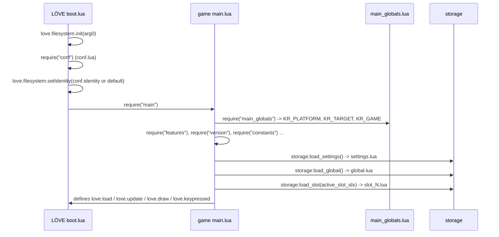
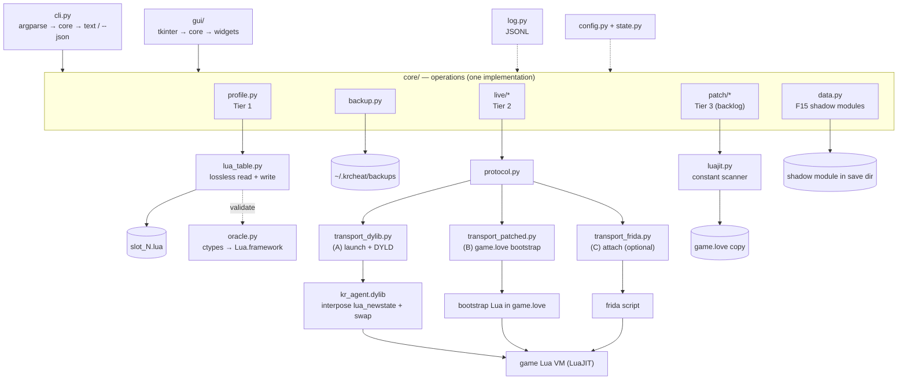

# krcheat — Foundation Document

**Project:** `krcheat` — a command-line trainer and save editor for *Kingdom Rush* on macOS
**Status:** specification / pre-implementation
**Revision date:** 2026-09-16
**Target build analysed:** Kingdom Rush `kr1-desktop-6.4.46` (Steam appid `246420`), macOS 15.7.9 x86_64

> This document is the canonical reference for the project. It consolidates every measured
> finding, the reverse-engineering results, the specification of the target system's runtime
> and persistence model, the design of the tool, the CLI contract, the safety model and the
> open questions. [`MACOS_TRAINER_PROPOSAL.md`](MACOS_TRAINER_PROPOSAL.md) is the earlier,
> shorter proposal and is superseded by this document where they disagree.

---

## Table of contents

1. [Purpose and scope](#1-purpose-and-scope)
2. [Executive summary](#2-executive-summary)
3. [Target application profile](#3-target-application-profile)
4. [Game code architecture](#4-game-code-architecture)
5. [Persistence model specification](#5-persistence-model-specification)
6. [Runtime state specification](#6-runtime-state-specification)
7. [Extension surface: what we can hook](#7-extension-surface-what-we-can-hook)
8. [Feature specification](#8-feature-specification)
9. [Architecture specification](#9-architecture-specification)
10. [CLI specification](#10-cli-specification)
11. [Live channel specification](#11-live-channel-specification)
12. [Save codec specification](#12-save-codec-specification)
13. [Module specification](#13-module-specification)
14. [Bytecode patcher specification](#14-bytecode-patcher-specification)
15. [Safety model](#15-safety-model)
16. [Testing and verification plan](#16-testing-and-verification-plan)
17. [Roadmap](#17-roadmap)
18. [Risk register](#18-risk-register)
19. [Open questions](#19-open-questions)
20. [Non-goals](#20-non-goals)
21. [Appendices](#21-appendices)

---

## 1. Purpose and scope

`krcheat` is a from-scratch macOS replacement for the existing Windows WinForms trainer in this
repository. It targets:

* **"Gold"** — unlimited gold during a level
* **"Health"** — unlimited lives (the Windows trainer's "Health" is the level life counter)
* **"Upgrades"** — unlocking tower/spell upgrades (the Windows trainer's `65`-star button)

and, because the macOS target is a Lua game rather than a compiled Unity binary, a superset of
extra capabilities at low marginal cost.

**In scope:** a Python 3 CLI, a save-file editor, a runtime Lua channel, optional offline
bytecode patching, packaging, tests, documentation.

**Out of scope:** a GUI, multiplayer (the game is single-player), DRM circumvention, asset
redistribution, Windows/Unity support.

---

## 2. Executive summary

The Windows trainer resolves `mono.dll`-relative pointer chains and blind-writes integers
(§Appendix A.1). **None of that transfers to macOS**: the macOS build is a completely different
engine, and the Mac game is not compiled in the sense the Windows one is.

| Dimension | Windows build | macOS build |
| --- | --- | --- |
| Engine | Unity | **LÖVE (Love2D) 0.10.1** |
| Language runtime | Mono / .NET IL | **LuaJIT 2.1** (Lua 5.1) |
| Game logic | compiled IL in assemblies | **555 Lua modules**, shipped as LuaJIT bytecode inside a ZIP |
| Trainer technique | external process memory write | save-file edit + in-process Lua evaluation |
| Achievable precision | pointer chains that break on updates | **name-based** field access that survives updates |

Three consequences drive the whole design:

1. **The save files are plain-text Lua tables** (`~/Library/Application Support/kingdom_rush/slot_N.lua`).
   Editing them requires no injection, no root and no compiler, and yields persistent
   progression changes (upgrades, stars, gems, hero XP, achievements).
2. **The bundle is signed with permissive entitlements** (`allow-dyld-environment-variables`,
   `disable-library-validation`) and **exports the full Lua C API** from `Lua.framework`.
   Therefore an in-process agent can evaluate arbitrary Lua inside the running game — a
   general-purpose trainer rather than a blind integer writer.
3. **Field access is by name, not by address**, so the trainer does not break when the game
   updates (a weakness of the original: hard-coded `mono.dll+0x1F2680` chains).

### 2.1 Design decisions (review of 2026-09-16)

Recorded here so the rest of the document can be read against them. Each is normative.

| # | Decision | Sections affected |
| --- | --- | --- |
| D1 | **Lossless codec.** The save reader preserves each scalar's original literal text; the writer re-emits untouched bytes verbatim and only renders nodes the tool changed. A command that changes nothing produces a **byte-identical** file. | §12 |
| D2 | **Mutation preconditions.** Mutating commands refuse to run while the game is running (`--force` overrides). Steam running is a prominent warning gated behind `--yes`, not a refusal. | §15 |
| D3 | **Spike S2 runs first**, before M1, and its result may re-scope the plan: if save-directory shadowing holds, Transport B collapses to "drop one file" and the bytecode patcher is demoted to the backlog. | §16.1, §17, §19 |
| D4 | **Spike S8 — the shipped `Lua.framework` is the verification oracle.** Loaded from Python via `ctypes` (stdlib only), it validates generated saves and patched modules against the real VM, and is the authoritative data source for id enumeration. | §13, §14, §16 |
| D5 | **F15 — persistent per-level data** (starting gold/lives, wave rewards) delivered as shadow data modules. | §8, §10.6 |
| D6 | **File-level safety only.** Snapshot per command run, validate, atomic swap, verify after swap, byte-identical restore. Not per-operation backups, no change journal, no bundle rollback. | §15 |
| D7 | **The CLI is the foundation.** Operations live in `core/`; `cli.py` and `gui/` are thin renderers over the same functions, so a GUI bug cannot diverge from CLI behaviour. | §9.5 |
| D8 | **File-based logging and configuration.** Append-only JSONL diagnostic log; `config.ini` for user settings and a separate `state.json` for machine-owned cache. | §9.6, §9.7 |
| D9 | **Slot selection is explicit and never persisted.** `--slot N` is passed per call; within one trainer session the last explicit value is reused; the cache is cleared at every startup, and if no slot has been given the user is **asked**, never guessed at. | §9.7, §10.7 |
| D10 | **macOS use is CLI-only, and F16 is deferred.** The tkinter wrapper stays in the tree as an optional renderer because it shares `core/` and costs nothing to keep, but it is **opt-in** (`ui.enabled`, default false) and no front-end work — no native port, no web UI — is planned. `doctor` therefore reports it as "not requested" rather than warning about a component nobody asked for. | §8.1, §9.5, §17, §20 |

### 2.2 Design decisions (review of 2026-09-17, after building M3–M5)

Recorded after the tier-2 implementation, from measurements rather than from the plan. Each is
normative, and each one contradicts something that earlier sections state or imply — the earlier
text has been amended where it did, and the finding is named here so the change is traceable.

| # | Decision | Sections affected |
| --- | --- | --- |
| D11 | **An override lives exactly as long as a process asks for it, and `--keep` is how a user asks for longer.** §11.7.4's heartbeat makes a crashed CLI harmless, which also means `live gold infinity` ends when the command ends. `--keep` spawns a detached *keeper* (`core/live/keeper.py`) that owns only the heartbeat, exits when the game does, and releases the overrides when it is stopped. Without this, "infinity" would have been a one-command cheat, which is not what the word suggests. | §11.7 |
| D12 | **The agent turns the JIT off for each snippet it runs, recursively, via `jit.off(chunk, true)`.** Measured: LuaJIT consults an instruction-count hook only in its interpreter, so a compiled loop is uninterruptible — `while i < 1e9 do i = i + 1 end` completed at full speed and `while true do end` hung the process, with the watchdog installed and apparently working. §11.6 called a hanging snippet the one failure the design cannot undo, so the mitigation is now structural rather than hoped for. Plain Lua 5.1 has no `jit` table and the count hook suffices there, so this is a no-op off LuaJIT. | §11.6 |
| D13 | **Capture and restore never round-trip through JSON.** The captured originals are kept as Lua references in `__krcheat_saved`, keyed by override key; the capture's *report* is JSON, but the restore path requires no `lib/json` and no decoding. Restoration is what runs when a user turns a cheat off or the heartbeat expires, so it must not be able to fail for an encoding reason, and a table-valued field (`game_outcome`) cannot be restored through JSON at all. | §11.4, §11.7 |
| D14 | **The response is deleted, not overwritten, when a request is written, and request ids are strictly increasing.** A caller that asks twice must not be able to read the first answer as the answer to the second question. Both halves are required: the id distinguishes responses, and the delete guarantees at most one is ever readable. This was a live bug — with ids that repeated, every `live` command reported the previous command's result. | §11.3 |
| D15 | **The agent's change detector uses a nanosecond timestamp.** A seconds-resolution `mtime` plus a size is not a change detector: two requests written in the same second with equal-length bodies are indistinguishable, so the second is never read and the caller times out. That is reachable in ordinary use (`live status` twice in a row). | §11.3 |
| D16 | **Transport A reaches the functions it interposes with plain direct calls, never `dlsym`.** Measured on dyld 4 from an inserted library: `dlsym(RTLD_NEXT, …)` returns NULL (an inserted image is first in load order, so there is nothing "next"), `dlsym(RTLD_DEFAULT, …)` and `dlsym(handle_of_the_defining_framework, …)` both return *the interposer*. The documented rule that makes this work is that an interposing image is not interposed, so its own direct reference is the original. | §9.3, §11.1 |
| D17 | **Transport B's bootstrap shadows `main_globals.lua`.** Verified from the shipped bytecode: it is 119 bytes whose entire constant pool is `KR_PLATFORM`/`KR_TARGET`/`KR_GAME`, and `main.lua` loads it by name. A replacement therefore has an exact contract — return those constants and add nothing — and `install --check` makes the *game* answer the S2 question (whether the save directory's copy wins) instead of the tool assuming it. | §3.3, §9.3, §16.1 |

---

## 3. Target application profile

### 3.1 Installation and identity

| Property | Value | Source |
| --- | --- | --- |
| Install path | `~/Library/Application Support/Steam/steamapps/common/Kingdom Rush/Kingdom Rush.app` | filesystem |
| Steam appid | `246420` | `steamapps` layout, `userdata/<account-id>/246420/` |
| Bundle id | `com.ironhidegames.kingdomrush.mac.steam` | `Contents/Info.plist` |
| Bundle version | `6.4.46` (build `46`) | `Contents/Info.plist` |
| Game version string | `kr1-desktop-6.4.46` | `version.lua` constants |
| LÖVE identity | `kingdom_rush` | `version.lua` constants; confirmed by save directory name |
| Display title | `Kingdom Rush` | `version.lua` (`title`) |
| Release flag | `RELEASE` | `version.lua` (`build`) |

`version.lua` also defines `bundle_keywords`, `bundle_id`, `string_short`, `-mac-steam`.

### 3.2 Engine and VM

| Property | Value | Source |
| --- | --- | --- |
| Framework | **LÖVE 0.10.1** | `love.framework/Versions/A/Resources/Info.plist` → `CFBundleShortVersionString = 0.10.1`, `CFBundleIdentifier = love2d.love` |
| Framework binary | `Frameworks/love.framework/Versions/A/love` (Mach-O) | `otool -L` |
| Script VM | **LuaJIT 2.1.0** | `Lua.framework/.../Info.plist` → `CFBundleIdentifier = LuaJIT.LuaJIT`, `CFBundleShortVersionString = 2.1.0` |
| LuaJIT internal version | `LuaJIT 2.1.1700008891`, Lua 5.1 semantics | `strings Lua.framework` |
| Executable | `Contents/MacOS/love` | `Info.plist` → `CFBundleExecutable = love` |
| Signature type | `CFBundleSignature = LoVe`, `PkgInfo = APPLLoVe` | bundle metadata |
| Architecture | Mach-O universal: `x86_64` + `arm64` | `file Contents/MacOS/love` |
| Host arch | `x86_64` (macOS 15.7.9) | `uname -m`, `sw_vers` |

Because LÖVE 0.10.1 is the runtime, the runtime contract documented in §7 and §12 is the
*shipped* LÖVE behaviour, not a guess: the embedded `boot.lua` is readable as plaintext inside
`love.framework` (§Appendix A.5).

### 3.3 Bundle contents

```
Kingdom Rush.app/Contents/
├── MacOS/love                          # LÖVE player, universal binary
├── Info.plist                          # com.ironhidegames.kingdomrush.mac.steam, 6.4.46
├── PkgInfo                             # APPLLoVe
├── _CodeSignature/CodeResources
├── Resources/
│   ├── game.love                       # 358 MB ZIP — ALL game code + assets
│   ├── kr1.icns, Assets.car, OS X AppIcon.icns
│   └── license.txt, license-kr-desktop.txt
└── Frameworks/
    ├── love.framework                  # LÖVE 0.10.1
    ├── Lua.framework                   # LuaJIT 2.1.0  (exports full Lua C API)
    ├── SDL2.framework                  # windowing / GL context / events
    ├── OpenAL-Soft.framework, Vorbis.framework, Theora.framework, Ogg.framework
    ├── FreeType.framework, libmodplug.framework
    ├── libsteam_api.dylib              # Steamworks
    └── libkcolorspace.dylib, libkhttps.dylib, libkrequest.dylib   # Ironhide "k*" libs
```

`features.lua` declares the enabled platform services for this flavour:
`platform_services` (`news`, `news_store`, `steam`), `news_ih`, `http`, `achievements`
(with `app_id`), and `libs` = `steam_api`, `khttps`, `krequest`, `kcolorspace`, `_ft`.

### 3.4 Code signature entitlements

```
com.apple.security.cs.allow-dyld-environment-variables    true
com.apple.security.cs.allow-jit                           true
com.apple.security.cs.allow-unsigned-executable-memory    true
com.apple.security.cs.disable-library-validation          true
com.apple.security.device.audio-input                     true
```

Implications:

* unsigned / third-party dylibs **may** be loaded (`disable-library-validation`);
* `DYLD_*` environment variables **are honoured** (`allow-dyld-environment-variables`).

Together these permit `DYLD_INSERT_LIBRARIES` injection at launch **without root, without
re-signing the game, and without disabling SIP**, which is the basis of live transport A (§9.3).

### 3.5 Save data location

| Path | Contents |
| --- | --- |
| `~/Library/Application Support/kingdom_rush/slot_%d.lua` | player profile slots (`SLOT_FILE_FMT = "slot_%d.lua"`) |
| `~/Library/Application Support/kingdom_rush/settings.lua` | video/audio/locale settings |
| `~/Library/Application Support/kingdom_rush/global.lua` | first-launch time, session count, news state |
| `~/Library/Application Support/kingdom_rush/steam_autocloud.vdf` | Steam cloud pointer |

Observed on the reference machine: `slot_1.lua` (7091 bytes), `settings.lua`, `global.lua`.

**Steam Cloud is enabled** for this title: `userdata/<account-id>/246420/remotecache.vdf` lists
`kingdom_rush/slot_1.lua` with `syncstate = 1`. This is a first-class hazard for a save editor
and is handled in §15.

---

## 4. Game code architecture

### 4.1 Archive layout

`Contents/Resources/game.love` is a ZIP archive: **1476 entries, 555 `.lua` entries**, of which
**326 are code modules** and **229 are asset metadata modules** under `_assets/kr1-desktop/`
(`images/`, `sounds/`, `strings/`). All are LuaJIT bytecode.

### 4.2 Module map

| Group | Count | Contents |
| --- | --- | --- |
| `kr1/` | 183 | Kingdom Rush 1 content: `game_scripts.lua`, `game_templates.lua`, `game_settings.lua`, `upgrades.lua`, `achievements_handlers.lua`, `data/levels/*`, `data/waves/*` |
| `all/` | 62 | engine-agnostic game framework: `game.lua`, `systems.lua`, `scripts.lua`, `storage.lua`, `storage_mappings.lua`, `constants.lua`, `debug_tools.lua`, platform services |
| `lib/` | 37 | third-party + Ironhide libraries: `hump/*`, `klove/*`, `klua/*`, `serpent.lua`, `json.lua`, `middleclass.lua`, `md5.lua`, `xmlSimple.lua`, `plc/*` |
| `kr1-desktop/` | 25 | desktop flavour: `game_gui.lua`, `screen_map.lua`, `screen_slots.lua`, `data/*`, `dotnet_slot_parser.lua` |
| `all-desktop/` | 13 | desktop platform services and screens |
| root | 6 | `main.lua`, `conf.lua`, `main_globals.lua`, `version.lua`, `features.lua`, `log_levels_release.lua` |

### 4.3 Boot sequence

Reconstructed from `main.lua` constants, `main_globals.lua`, `all/storage.lua` and the embedded
LÖVE `boot.lua`:



Relevant facts:

* `main.lua` contains the string `main_globals` ⇒ it is `require`d by name (line 530 of its
  constant pool). This matters for the "shadow module" experiment (§19 H1).
* `main.lua` references `run`, `present`, `timer`, `update`, `draw`, `keypressed` ⇒ **the game
  may install its own main loop** rather than relying solely on LÖVE's default `love.run`.
  This affects which per-frame hook is safest (§7.3).
* `main.lua` references `DEBUG` and `RELEASE`; `log_levels_release.lua` merely configures
  `klua.log` levels for release builds, so the shipped build runs with `DEBUG` false and the
  `all/debug_tools.lua` module inert.

### 4.4 Notable subsystems

| Module | Relevance to the trainer |
| --- | --- |
| `all/game.lua` | declares the live level state fields `player_gold`, `lives`, `lives_left`, `stars`, `health`, `game_outcome`, `restart_count`. Contains the debug string `"z/Z: time warp (%sx)"` and `"Lives checking OFF (store.game_outcome set)"` |
| `all/systems.lua` | contains `initial_gold`, `initial_lives`, `player_gold`, `lives`, endless-mode scoring and rewards |
| `all/scripts.lua` | per-entity scripts; references `player_gold`, `health` |
| `all/storage.lua` | the persistence layer: load/save/commit, slot validation, progress computation |
| `all/storage_mappings.lua` | declarative mapping table between persisted keys and runtime state |
| `all/debug_tools.lua` | shipped debug toolkit: entity dumps (`getdump`, `getfulldump`), `hide-gui`, `game-victory`, `game_outcome`, wave/level helpers, `keyseq`/`keypressed` handling |
| `all/constants.lua` | signal names (`SGN_*`), `GAME_MODE_*` (CAMPAIGN/HEROIC/IRON/ENDLESS), `DIFFICULTY_*` (EASY/NORMAL/HARD/IMPOSSIBLE), `MOD_TYPE_*`, ad types |
| `lib/json.lua` | JSON encoder/decoder shipped with the game — used for the live channel's wire format (§11.4) |
| `lib/serpent.lua`, `lib/klua/persistence.lua` | save (de)serialisation |
| `lib/klua/dump.lua` | table dumping — useful for `krcheat live probe` |
| `lib/klove/simulation.lua`, `lib/klove/input_state_machine.lua` | simulation/input cores |

---

## 5. Persistence model specification

### 5.1 Storage layer API (`all/storage.lua`)

Recovered constant pool (abridged, in order):

```
load_file / write_file / remove_file        # low-level, via `sio`
SETTINGS_FILE, SETTINGS_PARAMS
GLOBAL_FILE
new_slot, delete_slot, load_slot, save_slot, commit
SLOT_FILE_FMT, SLOT_MANDATORY_KEYS, SLOT_ADDITIONAL_DATA
active_slot_idx, "slot %s must exist before setting it as active"
"loaded slot %s has invalid data for %s. removing."
"hero %s skill %s outside valid range... patching to 0"
"adding missing hero %s to savegame"
"error saving slot %s", "slot-saved", "saving slot:%s should sync:%s"
get_slot_progress, get_challenge_progress
max_stars, crowns, gems, challenges_completed, num_heroic, num_iron, last_level, last_victory
```

Behavioural rules that the editor must respect:

| Rule | Consequence for `krcheat` |
| --- | --- |
| Slots are validated against `SLOT_MANDATORY_KEYS`; on mismatch the game logs *"loaded slot %s has invalid data for %s. removing."* and **deletes the slot** | never remove or rename top-level keys; only add expected keys or modify values |
| Missing heroes are re-added from the template (*"adding missing hero %s"*) | the editor must not delete `heroes.status.*` entries |
| Out-of-range hero skills are clamped to 0 | values written for `heroes.status.<h>.skills.<s>` must be within the game's valid range |
| Data is loaded with `loadstring` + `setfenv` and the chunk's **return value** is used | the file must be a valid Lua chunk returning a table |
| Save is written through `sio` (Ironhide `klua.persistence`) | see §12 for the exact output grammar |
| `should_sync` is passed to `write_lua` | Steam Cloud sync is part of the write path |

Progress values (`max_stars`, `crowns`, `num_heroic`, `num_iron`, `challenges_completed`) are
**derived** by `get_slot_progress` from `levels`; they are not stored. Therefore "give me N
stars" is implemented by writing `levels`, not a counter — this is why the Windows trainer's
`Upgrades = 65` maps to *"set `upgrades.*` to max"* on macOS (§8).

### 5.2 File format

`slot_%d.lua`, `settings.lua` and `global.lua` are all produced by the same serializer
(`lib/klua/persistence.lua`, a serpent-derived writer). Two shapes exist:

```lua
-- simple (no shared references) — the shape observed for slot_1.lua
local obj1 = {
	["key"] = value;
}
return obj1
```

```lua
-- with shared references (emitted only when the table graph has aliases)
local multiRefObjects = {
} -- multiRefObjects
local obj1 = { ... }
return obj1
```

Grammar constraints observed: tab indentation, `["key"] = value;` / `[n] = value;` entries,
`;` terminators, `true`/`false` booleans, decimal numbers (including full-precision floats such
as `0.021276595744681`), quoted strings. No functions, no comments, no `nil` entries.

### 5.3 Slot schema (measured from `slot_1.lua` v6.4.46)

| Key | Type | Semantics | Notes |
| --- | --- | --- | --- |
| `version_string` | string | `"kr1-desktop-6.4.46"` | preserve verbatim; used for save migration |
| `gems` | number | premium currency balance | observed `4154` |
| `difficulty` | number | last-used difficulty | observed `1`; see `DIFFICULTY_*` |
| `upgrades` | table<string, number> | purchased upgrade level per category | `archers`, `barracks`, `engineers`, `mages`, `rain`, `reinforcements`; observed 4/4/3/3/5/5 |
| `levels` | table<number, table> | per-level progress | keyed by level id; see §5.4 |
| `heroes.selected` | string | currently selected hero id | e.g. `hero_magnus` |
| `heroes.status.<hero>.xp` | number | hero experience | observed 0 for all |
| `heroes.status.<hero>.skills` | table | per-skill state | empty tables in the observed save |
| `achievements` | table<string, bool> | achievement unlocked flags | 44 entries observed, 74 defined |
| `achievement_counters` | table<string, number> | progress counters | e.g. `DIE_HARD = 159813` |
| `seen` | table<string, bool> | "already seen" flags for encyclopedia entries, tips, enemy/tower introductions | drives notification suppression |
| `bag` | table | inventory (consumables) | empty in the observed save |

### 5.4 `levels` semantics

```lua
["levels"] = {
    [1]  = { [1] = 1; [2] = 1; [3] = 1; ["stars"] = 3 };
    [14] = { };
    [23] = { };
    [81] = { ... };
}
```

* Level ids observed in content: **1–26** plus **81** (endless "orcs"); endless maps reference
  level `82` (endless "twilight") in the mapping table but no `level82` module ships.
* The `[1]`, `[2]`, `[3]` sub-keys are **mode/difficulty indices**. Evidence: the leaderboard
  mappings in `all/storage_mappings.lua` bind
  `levels[81][1].high_score` ↔ `endless_orcs_casual.score`,
  `[2]` ↔ `endless_orcs_normal`, `[3]` ↔ `endless_orcs_veteran`, while `all/constants.lua`
  defines `GAME_MODE_CAMPAIGN`, `GAME_MODE_HEROIC`, `GAME_MODE_IRON`, `GAME_MODE_ENDLESS`.
  So for story levels the three slots are campaign/heroic/iron; for endless levels they are
  casual/normal/veteran.
* `stars` is the per-level star total displayed on the map.
* Endless levels additionally use `high_score` and `waves_survived` keys.

### 5.5 Mapping table (`all/storage_mappings.lua`)

A declarative `src -> dst` list, evaluated with `do_row`/`pp_token`, combining a runtime
source path and a persisted destination path. Representative bindings:

| Runtime path | Persisted path |
| --- | --- |
| `notifications.notificationEnemyYeti` | `seen.enemy_yeti` |
| `notifications.notificationTowerMagesArcane` | `seen.tower_arcane_wizard` |
| `achievements.svEnemiesFallenCount` | `achievement_counters.ISTHATWILHELM` |
| `heroes_config.hero_malik.skills[1]` | `heroes.status.hero_malik.skills.<skill>` |
| `heroes_config.hero_malik.currentXP` | `heroes.status.hero_malik.xp` |
| `leaderboards.savedScores.endless_orcs_veteran.score` | `levels[81][3].high_score` |
| `leaderboards.savedScores.endless_orcs_veteran.maxWave` | `levels[81][3].waves_survived` |

The table is grouped per platform/target (`KR_TARGET` = `desktop`/`tablet`/`phone`,
`KR_PLATFORM` = `mac`/`ios`/`android`) and includes slot families `slot_common`, `slot_`,
`slot_kr1_endless`, `slot_kr2`, `slot_kr3`, `slot_kr3_endless` — i.e. **additional slot files
exist beyond `slot_1.lua`** and the CLI must discover `slot_*.lua` dynamically rather than
assuming a fixed set.

### 5.6 Settings and global files

`settings.lua` (measured):

```lua
fps = 60; fullscreen = false; height = 800; width = 1280; highdpi = true;
large_pointer = false; locale = "zh-Hans"; msaa = 0; pause_on_switch = false;
texture_size = "ipad"; timestamp = …; volume_fx = …; volume_music = …; vsync = false
```

`global.lua` (measured):

```lua
first_launch_time = …; marketing = { session_count = 9 };
news = { last_refresh_id = …; last_seen_time = …; mark_seen_time = … }
```

`SETTINGS_PARAMS` in `all/storage.lua` validates settings keys; the settings file is out of
scope for cheating but is read by `krcheat doctor` to detect locale/target (`texture_size`
selects the `_assets` variant).

---

## 6. Runtime state specification

### 6.1 Identifiers known to exist

Mined from module constant pools (`strings`), i.e. names that definitely appear as Lua string
constants in the shipped bytecode:

| Identifier | Module | Meaning |
| --- | --- | --- |
| `player_gold` | `all/game.lua`, `all/systems.lua`, `all/scripts.lua`, `all-desktop/game_gui.lua` | current gold in level |
| `initial_gold` | `all/systems.lua` | level start gold |
| `lives`, `lives_left`, `initial_lives` | `all/game.lua`, `all/systems.lua` | level life counter |
| `health` | many | entity/tower health (per-entity, not the level counter) |
| `stars` | `all/game.lua`, `all/storage_mappings.lua` | per-level star total (persisted) |
| `game_outcome` | `all/game.lua`, `all/debug_tools.lua` | win/lose flag; disabling it disables life checking |
| `restart_count`, `restarted` | `all/game.lua` | restart bookkeeping |
| `keep_gold` | `kr1/game_templates.lua` | per-entity flag to retain gold |
| `level_mode`, `level_idx`, `level_difficulty` | `all/debug_tools.lua`, `all/storage.lua` | current level identity |
| `max_upgrade_level`, `locked_towers`, `locked_powers`, `locked_hero` | `kr1/data/levels/*_data.lua` | per-level restrictions |

### 6.2 Access path — what is known and what is not

**Known:** the field names, and that `all/debug_tools.lua` accesses them as
`store.game.<field>` (the module references both `store` and `game` and then `lives_left`,
`game_outcome`), and that `all/storage.lua` reads `levels`, `stars`, `last_level`,
`last_victory` via `get_slot_progress`.

**Not yet verified:** the exact global owner chain (e.g. whether the live object is reachable as
`GAME`, `store.game`, or via a `director`/`gamestate` handle), and its field names at runtime.
This is deliberately **not hard-coded**: `krcheat live probe` enumerates the global environment
and the candidate tables at runtime and reports reachable paths, and the snippet library is
built from that output (§11.5). This is the single most important step of milestone M0.

### 6.3 Speed / time warp

`all/game.lua` contains the debug strings `"z/Z: time warp (%sx)"` and
`"Lives checking OFF (store.game_outcome set)"`. This indicates (inference, to be confirmed by
`probe`) that the debug build exposes a simulation speed multiplier and a life-check toggle.
If they exist in the release build as plain fields, they are the cleanest way to implement
speed-up and god-mode without touching entity health.

---

## 7. Extension surface: what we can hook

### 7.1 Lua C API

`Frameworks/Lua.framework/Versions/A/Lua` exports **87 `lua_*` / `luaL_*` symbols**. Verified
present and directly usable by an injected agent:

```
luaL_loadstring, luaL_loadbuffer, luaL_loadbufferx,
lua_pcall, lua_call, lua_getfield, lua_setfield, lua_gettable,
lua_pushnumber, lua_pushstring, lua_tonumber, lua_tonumberx, lua_tolstring,
lua_type, lua_typename, lua_gettop, lua_settop, lua_next,
lua_createtable, lua_gc, lua_close, lua_dump, lua_getfenv, lua_getinfo, lua_getlocal, …
```

Because LuaJIT exposes `luaL_loadstring`, an agent can compile and run **arbitrary Lua source**
inside the game process.

### 7.2 Getting the `lua_State*`

LÖVE 0.10.1 creates exactly one main state. The proposed capture strategy is to interpose the
state constructor (`luaL_newstate` / `lua_newstate`) via a `__DATA,__interpose` section, which
requires no symbol patching and no root.

### 7.3 Getting a safe execution window

Lua states are not thread-safe; the snippet must run **on the game's own Lua thread while the VM
is idle**. Candidates, in order of preference:

| Candidate | Rationale | Status |
| --- | --- | --- |
| `SDL_GL_SwapWindow` | exported by `SDL2.framework` (verified: `T _SDL_GL_SwapWindow`), called once per presented frame by LÖVE's OpenGL path, on the main thread, with the VM idle | **recommended** |
| `love.graphics.present` (`love::graphics::Graphics::present`) | called once per frame by LÖVE's default `love.run` (verified in the embedded `boot.lua`: `love.graphics.present()`), but is redefinable from Lua | fallback |
| `SDL_PollEvent` | exported (verified: `T _SDL_PollEvent`), called multiple times per frame in `love.event.poll()` | fallback |
| `love.timer.step` | called by `love.run` and by most custom loops | fallback (Lua level) |

Note that `main.lua` references `run` and `present`, so the game may replace `love.run`; a
C-level hook (`SDL_GL_SwapWindow`) is therefore the more robust choice. The agent should try
candidates in order and log which one succeeded.

### 7.4 Toolchain availability (reference machine)

| Tool | Status |
| --- | --- |
| `clang` | `/usr/bin/clang` — Apple clang 17.0.0, target `x86_64-apple-darwin24.6.0` |
| `codesign` | `/usr/bin/codesign` (for ad-hoc signing the agent dylib) |
| Xcode CLT | `/Library/Developer/CommandLineTools` |
| `python3` | `3.9.6` at `/usr/bin/python3`; `pyenv global` is `3.14` → `3.14.3` (re-measured 2026-09-16, after the review; `3.13.14` also installed) |
| `tkinter` | **must be verified per-interpreter** — pyenv builds frequently omit `_tkinter`. Confirmed 2026-09-16: the pyenv 3.13/3.14 builds have **no `_tkinter`**, while `/usr/bin/python3` has Tk **8.5**, which `abort()`s on window creation (`macOS 15 (1507) or later required, have instead 15 (1506) !`). So no available interpreter can open a window here, and the abort is not catchable — the preflight must be static (§7.4, and `IMPLEMENTATION.md` §5) |
| `frida` | **not installed** (only relevant to the optional transport C) |

`python3 3.9` sets the language floor: the CLI must be **Python 3.9 compatible** (no `match`,
no `X | Y` type unions at runtime without `from __future__ import annotations`, etc.).

Tk has two macOS-specific constraints that §9.5 must handle, not discover at runtime:

* `_tkinter` is an optional build-time module. `import tkinter` must be attempted behind a
  guard, and `krcheat gui` must fail with a clear message rather than a traceback.
* A non-framework Python build (pyenv, some Homebrew builds) produces Tk windows that open
  behind the terminal and refuse focus. `doctor` reports whether the interpreter is a
  framework build.

Both are environment properties, so `doctor` reports them; the CLI and tiers 1–3 have no
dependency on Tk whatsoever.

---

## 8. Feature specification

### 8.1 Feature map

| ID | Feature | Original equivalence | Mechanism | Tier |
| --- | --- | --- | --- | --- |
| F1 | Set/infinite **gold** in the current level | "Gold" checkbox | live channel, `player_gold` | 2 |
| F2 | Set/infinite **lives** in the current level | "Health" checkbox | live channel, `lives`/`lives_left` | 2 |
| F3 | **Unlock all upgrades** | "Upgrades = 65" button | save file, `upgrades.*` | 1 |
| F4 | **Set stars** for all levels / a level | (alternative to F3) | save file, `levels[n].stars` | 1 |
| F5 | Set **gems** | new | save file, `gems` | 1 |
| F6 | Set **hero XP / skills** | new | save file, `heroes.status.*` | 1 |
| F7 | Unlock all **achievements** (in-game flags) | new | save file, `achievements.*` | 1 |
| F8 | Unlock all **`seen`** entries (encyclopedia/notifications) | new | save file, `seen.*` | 1 |
| F9 | **Game speed** multiplier | new | live channel | 2 |
| F10 | **God mode** (disable life checking) | new | live channel, `game_outcome` | 2 |
| F11 | **Arbitrary Lua evaluation** | new | live channel | 2 |
| F12 | **State probe/discovery** | new | live channel | 2 |
| F13 | Offline **bytecode patching** (permanent tweaks) | new | `game.love` copy | 3 |
| F14 | **Backup / restore / doctor** | new | filesystem | 1 |
| F15 | Persistent per-level data: **starting gold, starting lives, wave rewards** | "Gold"/"Health" as a *persistent* tweak rather than a live write | shadow data module (§9.8) | 1 (depends on S2; falls back to 3) |
| F16 | **tkinter GUI wrapper** | the WinForms front end itself | `gui/` over `core/` (§9.5) | front-end (deferred, D10) |

### 8.2 Acceptance criteria

* **F1/F2** — with the game running in a level, `krcheat live gold infinity` makes the gold
  counter stop decreasing and new towers become affordable within one frame; `krcheat live
  gold off` restores normal behaviour; the value is *not* persisted to the save file.
* **F3** — after `krcheat profile set upgrades all=5` and a game restart, the upgrade screen
  shows every upgrade purchased, with no invalid-slot warning in the game log.
* **F4** — after `krcheat profile set stars all`, the map screen shows the maximum star count
  and the "stars earned" totals on the map reflect it.
* **F5–F8** — the corresponding UI counters change after restart; the game does not delete the
  slot.
* **F14** — every mutating command takes a verified snapshot before its first write, and
  `krcheat backup restore <id>` returns the file to a byte-identical state (D6).
* **F15** — with a level-data override applied, the affected level starts with the configured
  gold/lives; `data revert` restores the shipped values exactly; the game's slot validation
  still passes. **Requires S2**; if S2 fails, F15 moves to tier 3 and inherits its risks.
* **F16** — the GUI performs every tier-1 and tier-2 operation the CLI can, through the same
  `core/` functions; a snapshot is taken and the running-game gate is enforced identically.
  No operation is GUI-only.
* **All tier-1 commands** must work with **no** compiler, no root, no injection, and while the
  game is not running.

---

## 9. Architecture specification

### 9.1 Component overview



### 9.2 Tier 1 — save editor (no injection)

Pure Python, stdlib only. Responsibilities: discover the save directory and slots, read and write
the Lua-table format **losslessly** (§12, D1), validate against the schema, snapshot before
writing (§15.2), and expose the profile operations of §8.1 (F3–F8, F14, and F15 where S2 allows).
This is the first shippable milestone because it cannot corrupt anything permanently (snapshot +
validation + atomic swap) and needs no privileges.

### 9.3 Tier 2 — live channel

**Transport A (primary): launch-time dylib injection.**

```
DYLD_INSERT_LIBRARIES=<path>/kr_agent.dylib \
SteamAppId=246420 \
"<...>/Kingdom Rush.app/Contents/MacOS/love"
```

The agent is a small C dylib that:

1. `dlopen`s `Lua.framework` (or resolves symbols via `RTLD_DEFAULT` after LÖVE loads it);
2. interposes `luaL_newstate`/`lua_newstate` to capture the `lua_State *`;
3. interposes `SDL_GL_SwapWindow` (fallbacks `SDL_PollEvent`, `Graphics::present`) to obtain a
   once-per-frame callback on the main thread;
4. on each tick, checks the command channel; if a request is pending, runs it with
   `luaL_loadstring` + `lua_pcall` and writes the response;
5. maintains a persistent "always-on" snippet for `infinity` modes, re-applied each frame.

Pros: does not modify the game installation at all; no root; no signature invalidation; the
game can be launched with or without cheats by the CLI. Cons: requires `clang` once, and the
game must be started by the CLI (Steam overlay/cloud sync are inactive — which is *safer* for
save editing). The dylib should be ad-hoc signed (`codesign -s -`) so it also works on
Apple-silicon hosts, where unsigned arm64 dylibs are rejected.

**Transport B (no-compiler fallback): patch `game.love`.**

> **Conditional on spike S2 (D3).** If the save directory shadows the game source, Transport B
> is *not* this. It becomes: generate one Lua source module into the save directory and let
> `require` find it first — no ZIP repack, no pristine copy, no `repair`. The ZIP-repack
> description below is retained as the fallback for the case where S2 fails.

`game.love` is a ZIP. Replace the bytecode `main_globals.lua` (119 bytes; its entire constant
pool is `KR_PLATFORM="mac"`, `KR_TARGET="desktop"`, `KR_GAME="kr1"`) with an equivalent **Lua
source** module that also installs a bootstrap (command-file poller on a per-frame Lua hook).
Repack the archive, keeping a pristine copy for `krcheat repair`. Then the game can be launched
normally from Steam and the live channel still works.

Pros: no compiler, no injection, works with a normal Steam launch, doubles as a modding
platform. Cons: modifies game files; "Verify integrity of game files" reverts it (the CLI can
re-apply); assumes `main_globals` is required by name (verified present in `main.lua`) and that
a stable per-frame Lua hook exists.

**Transport C (optional): attach to a Steam-launched process** via `frida`. Requires
`pip install frida` and, in practice, `sudo` on macOS. Last resort.

All three share the protocol of §11, so the CLI is written once and the transport is a
configurable strategy.

### 9.4 Tier 3 — offline bytecode patching (optional/experimental)

See §14. **Demoted to the backlog by D3** — it is only pursued if spike S2 fails and F15
therefore cannot be delivered as a shadow module.

### 9.5 Front-ends and the core seam (D7)

The CLI is the foundation, and the way that is enforced is structural: **operations are the
contract, not the CLI process.** All behaviour lives in `core/`; the CLI and the GUI are thin
renderers over the same functions.

| Layer | May contain | Must not contain |
| --- | --- | --- |
| `core/` | operations, the safety model of §15, schema knowledge, the codec, transports | `argparse`, `print`, exit codes, widgets |
| `cli.py` | argument parsing, `Result` → text/`--json` rendering, exit codes | any operation logic |
| `gui/` | widgets, event wiring, worker-thread marshalling | any operation logic |

Every operation has one signature — `fn(ctx, **args) -> Result` — where `Result` carries the
changed nodes, warnings, snapshot id, and the exit-code semantics of §10.5. The CLI renders a
`Result` as text or JSON; the GUI renders the same `Result` into widgets.

Consequences that must hold:

* The GUI **never shells out to `krcheat`**. Doing so would create a second, divergent path and
  lose the structured `Result`.
* A GUI bug cannot diverge from CLI behaviour, because there is only one implementation.
* The GUI is optional: tiers 1–3 have no dependency on Tk, and every operation remains
  reachable from the CLI.

**GUI shape.** Deliberately mirrors the original trainer's mental model, on the new safety
model:

* *Profile panel* — gems, upgrades grid, stars, hero XP; Refresh, and Apply behind a confirm
  dialog that is the `--dry-run` diff rendered.
* *Live panel* — game status, active transport, and Gold / Lives / Speed / God as the original
  checkboxes; disabled unless the agent is up, with the active overrides always visible.
* *Log pane* — tails the current diagnostic log (§9.6). This is the debugging surface.
* *Menu* — Doctor, Open backups, Restore snapshot, View log.

**Threading is mandatory, not an optimisation.** Tk is single-threaded and not thread-safe.
Every long operation — `doctor`, `mine`, an archive repack, and especially channel requests
with their 2 s timeout — runs on a worker thread and marshals back through a `queue.Queue`
polled by `root.after(50, …)`. No widget is touched from a worker thread.

**Safety parity.** The GUI honours the same rules as the CLI with no exceptions: snapshot
before the first write of a run, the running-game gate, the Steam warning as a modal, and
`--dry-run` semantics for the confirm dialog. There is no GUI-only operation.

### 9.6 Diagnostic log (D8)

Two **append-only JSONL** streams — one JSON object per line, flushed per record so a crash
still leaves a usable tail:

| Stream | Location | Contents |
| --- | --- | --- |
| CLI/GUI | `~/.krcheat/logs/krcheat-YYYYMMDD.jsonl` | command, snapshot id, file hashes before/after, changed-node count, validation results, channel request id + latency + Lua error string, tracebacks for exit 6 |
| Agent | `$TMPDIR/krcheat/<pid>/log` (§11.3), **copied to `~/.krcheat/logs/agent-<pid>.jsonl` on clean exit** | hook selection, frame counter, snippet errors |

The agent copy matters because `$TMPDIR` is reaped by the OS; without it the agent log —
the only record of which hook was selected — is lost.

Rules:

1. Log **values, not contents**: hashes, paths, sizes and counts by default; field values only
   at `-vv`, truncated.
2. Rotation by day plus a total size cap; pruned at startup so the log can never grow without
   bound.
3. The log is diagnostic only. It is never read back as state, and deleting it must be safe.
4. A logging failure is never fatal: if the log cannot be opened, the operation proceeds.

CLI surface in §10.6.

### 9.7 Configuration and state (D8)

Configuration and state are **separate files with separate owners**. Mixing them means a
machine-written blob eventually destroys hand-written comments — a classic and avoidable
failure.

| File | Owner | Contents |
| --- | --- | --- |
| `~/.krcheat/config.ini` | user, hand-editable | `[paths]` game/save-dir overrides; `[ui]` window geometry, last tab, confirm-before-write; `[live]` preferred transport, request timeout; `[logging]` level, retention |
| `~/.krcheat/state.json` | machine | `version_string` + archive hash, **slot inventory** (which slots exist, not which is selected), last `doctor` summary, last snapshot id, probed live field paths, mined id sets |

`configparser` and `json` are both standard library, so the Python 3.9 / no-dependency policy
holds. TOML is deliberately excluded — `tomllib` is 3.11+ and `tomli` would be a dependency.
Unknown keys read from `config.ini` are preserved on rewrite. Precedence is
**CLI flag > config > state > built-in default**.

**One deliberate exception: slot selection is not persisted at all** (D9, §10.7). It appears in
neither file, so it is absent from that precedence chain by design — a slot is supplied per
call, reused only within a session, and otherwise asked for.

`state.json` earns its place twice over: cached probe results and mined id sets are keyed on
`version_string` + archive hash, so repeat runs skip both the S8 oracle load and the constant
pool walk — and a game update invalidates them automatically instead of silently reusing stale
field paths.

### 9.8 Shadow data modules (F15)

Conditional on S2. Where the game reads a data module from `game.love`, a same-pathed **Lua
source** module placed in the save directory shadows it, because LÖVE mounts the save directory
over the game source (§19 H1). F15 therefore delivers persistent level-data overrides by
generating one such module rather than by patching bytecode.

* Generation only — no ZIP surgery, no in-place bytecode edits, no re-signing.
* Reversal is `uninstall` of the file; `data revert` restores the shipped values exactly,
  which is verifiable by the S8 oracle (§14).
* The generated module must be *additive*: it overrides the fields it targets and leaves the
  rest of the table untouched, so a game update does not silently inherit stale values.
* Removed automatically if `version_string` changes, since the shadowed module's shape is not
  guaranteed across versions.

---

## 10. CLI specification

Entry point: `krcheat` (installed via `pipx`/`pip`, or `python -m krcheat`).

Global options:

```
--game PATH        override app bundle path
--save-dir PATH    override save directory
--slot N           profile slot; explicit, reused within a session (§10.7)
--json             machine-readable output
--dry-run          show what would change, write nothing
--yes              assume yes for confirmations
--force            override a safety gate (game running, version mismatch)
--log-level L      debug | info | warn | error  (default from config)
--log FILE         override the log destination
--no-log           disable logging for this run
--verbose / -v     debug logging to stderr
--version, --help
```

**Placement convention:** global options are written *before* the subcommand —
`krcheat --dry-run profile set gems 9999`. This is the only documented form; the usage strings
elsewhere in this section that show `--dry-run` after a subcommand are illustrative of the
effect, not of the spelling.

### 10.1 Environment and diagnostics

| Command | Behaviour |
| --- | --- |
| `krcheat doctor` | verifies: app bundle found, version, save dir present and writable, save parses, Steam Cloud state, running process, agent availability (dylib built? clang present?), `_tkinter` importable and whether the interpreter is a framework build (§7.4), log directory writable, `config.ini` parses, `state.json` cache valid for the installed `version_string`, and prints a summary with pass/fail per check |

### 10.2 Profile (Tier 1)

| Command | Behaviour |
| --- | --- |
| `krcheat profile show [--json]` | pretty-print the parsed profile: gems, difficulty, upgrades, stars per level, hero XP, achievement counts |
| `krcheat profile get <path>` | dotted/indexed path read, e.g. `levels.1.stars`, `heroes.status.hero_malik.xp` |
| `krcheat profile set gems <n>` | set premium currency |
| `krcheat profile set difficulty <n>` | set last difficulty (1–4 per `DIFFICULTY_*`) |
| `krcheat profile set upgrades all=<n>` | set every upgrade category |
| `krcheat profile set upgrades <cat>=<n>` | set one of `archers`, `barracks`, `engineers`, `mages`, `rain`, `reinforcements` |
| `krcheat profile set stars all [--stars N]` | mark every level complete with N stars in all modes |
| `krcheat profile set level <n> stars <n> [--mode campaign\|heroic\|iron]` | per-level tuning |
| `krcheat profile set level <n> clear --mode <m>` | clear completion flags |
| `krcheat profile set hero <id> xp <n>` | hero experience |
| `krcheat profile set hero <id> skills all=<n>` | all skills (`skills` are keyed by skill *name*, resolved from the mapping table; values are clamped by the game) |
| `krcheat profile set achievements all\|none\|<ID>[,<ID>…]` | achievement unlock flags |
| `krcheat profile set counters <ID> <n>` | achievement counters |
| `krcheat profile set seen all` | mark every `seen.*` entry true |
| `krcheat profile list achievements\|heroes\|levels\|upgrades` | enumerate the known ids (mined from the archive's bytecode constant pool) |

### 10.3 Live (Tier 2)

| Command | Behaviour |
| --- | --- |
| `krcheat play [--no-cheats] [-- steam-args…]` | launch the game (Transport A) with the agent loaded |
| `krcheat install` / `krcheat uninstall` | install/remove the Transport B bootstrap; `uninstall` also removes the dylib |
| `krcheat repair` | re-apply Transport B after a Steam integrity check or game update |
| `krcheat live status` | channel health: agent present, hook in use, game state, current overrides |
| `krcheat live probe [--out FILE]` | enumerate globals/tables and dump the reachable state paths (uses the game's `lib/json.lua` for encoding) |
| `krcheat live gold <n\|infinity\|off>` | one-shot value, per-frame override, or `off` — which **restores the value captured when the override was registered** (§11.7), not merely stops enforcing |
| `krcheat live lives <n\|infinity\|off>` | ditto |
| `krcheat live speed <n\|off>` | simulation multiplier (`time warp`) |
| `krcheat live god on\|off` | disable life checking (`game_outcome`) |
| `krcheat live eval "<lua>"` | evaluate an arbitrary snippet and print the JSON result. `once`-only: arbitrary code is never installed as a per-frame override (§11.6) |
| `krcheat live watch` | interactive prompt evaluating snippets until Ctrl-D |

### 10.4 Patching and backup

| Command | Behaviour |
| --- | --- |
| `krcheat backup list` | list snapshots with timestamp, path, size, hash and the command that created them |
| `krcheat backup restore <id>` | restore a snapshot byte-identically, verified against its manifest (§15.2 step 5) |
| `krcheat backup prune --keep N` | manual pruning. Snapshotting is automatic; retention is not (§15.4) |
| `krcheat patch scan <value> [--module PATH] [--type number\|int]` | find constants equal to a value in a module's bytecode (e.g. `265`, `20`) |
| `krcheat patch apply` / `--yes` | write a patched copy of the archive |
| `krcheat patch restore` | restore the pristine archive |

### 10.5 Exit codes

| Code | Meaning |
| --- | --- |
| 0 | success |
| 1 | usage error |
| 2 | game/app/save not found |
| 3 | channel unavailable (game not running / agent absent) |
| 4 | validation failure (schema, mandatory keys, out-of-range value) |
| 5 | backup or restore failure |
| 6 | internal error |

### 10.6 Log, config, level data and GUI

| Command | Behaviour |
| --- | --- |
| `krcheat log tail [--lines N]` | print the tail of the current diagnostic log (§9.6). `--json` is implied by the `--json` global; otherwise records are rendered as one line each |
| `krcheat log path` | print the active log file path, for `tail -f` or `open -R` |
| `krcheat log prune` | apply the retention policy now instead of at next startup |
| `krcheat config list` / `get <key>` / `set <key> <value>` | read and write `config.ini` (§9.7), preserving unknown keys and comments |
| `krcheat config path` | print the config file path |
| `krcheat data list` | list the levels whose data can be overridden, and which overrides are currently installed (F15) |
| `krcheat data set level <n> starting_gold <n>` / `starting_lives <n>` | generate or extend the shadow module for a level (§9.8) |
| `krcheat data set wave <n> gold <n>` | ditto, for wave rewards |
| `krcheat data revert [--level <n>]` | remove the shadow module for a level, or all of them; shipped values are restored exactly |
| `krcheat gui` | launch the tkinter wrapper (§9.5). Fails with a clear message if `_tkinter` is unavailable |

Notes:

* `data *` is the F15 surface. Like `install`/`patch`, it writes into the game's *read* path
  (the save directory) and is therefore subject to the same snapshot and gate rules.
* `config set` writes only `config.ini`. `state.json` is machine-owned and never hand-edited;
  it is removed, not edited, when invalidated.
* `live status` reports the active transport, so the same information is available when both a
  dylib agent and a patched transport are present.

### 10.7 Slot resolution (D9)

The user may want to modify any slot, so **the slot is never guessed and never persisted.**

Resolution order, applied only by commands that operate on a profile:

1. **`--slot N`, if given.** Always wins, and is recorded as the session's slot.
2. **The session's slot**, if one was set earlier in the same session — a `krcheat gui` run, or
   a `live watch` prompt loop. This is what makes passing `--slot` once per call bearable inside
   a longer session.
3. **Ask explicitly.** With no `--slot` and no session value, the CLI prompts, listing the slots
   found on disk (`find_slots()`), and requires an answer. It does **not** fall back to the
   highest number or the newest mtime: with several profiles in play, a wrong guess edits the
   wrong save.
4. **Non-interactive with no slot → usage error, exit 1**, naming `--slot`. A prompt must never
   hang a script or a pipe.

**The session cache is in memory and is cleared at every trainer startup.** Nothing about slot
selection is written to `state.json` or `config.ini`, so a new `krcheat` invocation begins with
no slot and either receives `--slot` or asks. The consequence is deliberate: a stale slot can
never silently apply an edit to the wrong profile, which is the failure mode that matters here.

Naming a slot that does not exist is **exit 2**, never a silent create — §5.1 records that the
game itself refuses to make a non-existent slot active, and we mirror that.

**Commands that do not need a slot never resolve one**, and therefore never prompt:

| Command family | Why no slot is needed |
| --- | --- |
| `doctor` | reports on every slot found |
| `backup list` / `restore <id>` | the snapshot records its own source path |
| `config *`, `log *` | tool configuration and diagnostics are slot-independent |
| `data *` | F15 overrides are game-wide, not per-slot |
| `live *` | the channel addresses the running game, and uses whichever slot it already loaded |

This keeps the prompt out of every path that does not genuinely need an answer.

---

## 11. Live channel specification

### 11.1 Transport independence

The CLI depends only on a `LiveTransport` interface:

```python
class LiveTransport(Protocol):
    def available(self) -> bool: ...
    def start(self, launch: bool) -> None: ...
    def stop(self) -> None: ...
    def request(self, code: str, timeout: float = 2.0) -> Response: ...
```

Implementations: `DylibTransport` (A), `PatchedLoveTransport` (B), `FridaTransport` (C).
Selection order is configurable via `--transport`.

### 11.2 Message format

Request (Lua source to evaluate, plus correlation, mode and key):

```json
{ "id": 42, "mode": "once",   "key": null,   "code": "return json.encode({ gold = GAME.player_gold })" }
{ "id": 43, "mode": "always", "key": "gold", "code": "<snippet>", "capture": "<snippet>", "restore": "<snippet>", "heartbeat_seconds": 10.0 }
{ "id": 44, "mode": "clear",  "key": "gold", "code": null }
{ "id": 45, "mode": "status", "key": null,   "code": null }
```

`mode` is one of:

| Mode | `key` | Semantics |
| --- | --- | --- |
| `once` | ignored | evaluate now, return the result |
| `always` | **required** | evaluate every frame until replaced or cleared (the "infinity"/checkbox behaviour). A second `always` with the same key **replaces** the first |
| `clear` | **required** | remove a registered `always` snippet and restore the value captured when it was registered (§11.7). `key = "*"` clears every override |
| `status` | ignored | report the agent's own override table (§11.7.5) — this is how `live status` answers "what is active right now" |

The `key` is a short stable identifier (`gold`, `lives`, `speed`, `god`) and is what makes
`live status` able to enumerate active overrides.

`capture` and `restore` were added after implementation (D13). `always` alone is not enough to make
an override reversible: only the snippet library knows which fields a given override touches, so
the capture and the restore must be supplied alongside the code, and the agent runs the capture
**before** the first write. The three are built together by `snippets.override_snippets(key)`,
because a capture that disagrees with its restore is worse than no capture at all.

`heartbeat_seconds` is how the CLI tells the agent how long a stale heartbeat may persist
(§11.7.4); it is optional, and defaults to 10 s.

Response:

```json
{ "id": 42, "ok": true, "result": "{\"gold\":265}", "error": null, "ms": 0.4 }
```

The response echoes `id` and `key`, and `error` carries the `lua_pcall` message verbatim when
`ok` is false. `result` is always a string produced by the snippet itself (§11.4).

### 11.3 Channel mechanics

* Directory: `$TMPDIR/krcheat/<gamepid>/` (per-process isolation, auto-cleanable).
* Files: `cmd.json` (request), `out.json` (response), `hb` (heartbeat timestamp), `log` (agent log).
* **The request handoff is atomic.** The CLI writes `cmd.json.tmp` and renames it over
  `cmd.json`; the agent keys on the rename rather than on content. A polling reader and a
  writing producer otherwise race, and a torn read surfaces as an intermittent parse failure
  that looks like an agent bug. The agent writes `out.json` by the same write-and-rename rule.
* The agent `stat`s the channel directory once per frame (negligible) and acts only when the
  entry changed. **"Changed" means (mtime, size) at nanosecond resolution** (D15): a
  seconds-resolution timestamp plus a size is not a change detector, because two requests
  written in the same second with bodies of the same length are indistinguishable — the second is
  never read, and the caller times out. That is reachable in ordinary use.
* **A new request deletes the previous response** (D14). A response must be readable exactly
  once; combined with strictly increasing `id`s, that is what stops a caller from reading the
  answer to its previous question as the answer to this one.
* **Response size is capped** (e.g. 1 MiB) and truncated by the agent with a marker, so a
  `probe` dump cannot fill the channel or the caller's memory.
* Latency target: one frame (≈16 ms at 60 fps) plus polling; CLI timeout default 2 s.
* A unix socket alternative (`$TMPDIR/krcheat.sock`) may be added later; the file channel is
  chosen first because it is inspectable, survives agent restarts, and needs no cleanup logic.

### 11.4 Result encoding

Responses must be serializable. Rather than implementing a serializer in the agent, the CLI
wraps snippets so that the *snippet itself* encodes the result using the game's own bundled
JSON library:

```lua
local json = require("lib.json")
local out = { ... }              -- whatever we want to report
return json.encode(out)
```

This removes all type-marshalling work from C and Python, and guarantees the encoding matches
the game's data model (`lib/json.lua` is shipped in `game.love`).

### 11.5 Snippet library

Game-specific knowledge lives in Python (`live/snippets.py`) as parameterised Lua templates, so
that discovering a new field or fixing a broken path requires no C/Python logic changes and no
recompilation. Initial set:

| Snippet | Template (illustrative — exact owner paths are filled in after `probe`) |
| --- | --- |
| `gold_inf` | `local s = <owner> s.player_gold = 99999` |
| `lives_inf` | `local s = <owner> s.lives_left = <n>` (and/or `s.lives`) |
| `god_on` | disable life checking via `game_outcome` |
| `speed` | set the `time warp` multiplier |
| `probe` | walk `_G`, `store`, `game`, report table shapes and scalar values |
| `eval` | pass through user-supplied Lua |

A hard rule: snippets must be **non-destructive and reversible**, and must never call
`love.event.quit`, `os.exit`, file I/O outside the channel, or mutate persisted state (tier 1
owns that).

### 11.6 Agent hardening

* Re-entrancy guard (never evaluate while a snippet is running, including from the hook). The
  guard must also survive a snippet that itself calls back into the hook.
* Size cap on `cmd.json` (e.g. 64 KiB) **and** on `out.json` (§11.3).
* All agent I/O wrapped so a failure cannot take down the game: on error, log and continue.
* The agent never blocks the main thread: it reads/writes files, never waits.
* **Snippets must not loop.** A `while true do end` inside an `always` snippet hangs the game's
  main thread and is **not recoverable** except by force-quitting the process — the channel
  cannot be used to fix it, because the code that would read the fix is the code that is
  hanging. This is the one live-channel failure the design cannot undo, so it is prevented
  structurally at three levels: `always` snippets are built from fixed templates with no
  user-supplied control flow (`snippets.assert_safe` refuses loop keywords outright), `live eval`
  is `once`-only, and the agent runs every snippet under an instruction-count watchdog.
* **The watchdog only works if the snippet is not JIT-compiled** (D12). The count hook is
  consulted by LuaJIT's interpreter, and a compiled trace never returns to it. The agent
  therefore calls `jit.off(chunk, true)` before running anything, which marks that chunk and the
  prototypes inside it — and nothing else. Measured without it: a billion-iteration counter loop
  ran to completion in 2.5 s and `while true do end` hung the process. With it: every shape of
  runaway loop is killed in about 0.3 s and the agent keeps answering afterwards.
* Overrides are cleared on level change detection (configurable) to avoid surprising carry-over.
  *Not implemented*; it is off by default and needs a running game to calibrate.

### 11.7 Override lifecycle

`always` and `clear` are not symmetric with a plain write, and the difference is the thing most
likely to surprise a user, so it is specified explicitly:

1. **On registering an `always` override, the agent first reads and stores the current value**
   of every field the snippet touches. Which fields those are is not something the agent infers:
   the request carries a `capture` snippet (§11.2), built together with the `code` and the
   `restore` so the three cannot disagree.
2. The agent re-applies the snippet each frame while the override is active.
3. **`clear` restores the stored value** and removes the override. It does not merely stop
   enforcing — otherwise the last written value silently persists and `off` would appear to do
   nothing.
4. **Heartbeat-based auto-clear.** If the CLI heartbeat (§11.3 `hb`) goes stale — default 10 s,
   configurable — the agent clears all overrides and restores their stored values. A crashed or
   forgotten CLI must not leave the game permanently modified.
5. `live status` always reports the full set of active override keys and their current values,
   so "what is active right now" is answerable without inspecting the game.

The captured originals are **Lua references, not JSON** (D13). They live in a table keyed by
override key (`__krcheat_saved`), which is what lets a table-valued field be restored exactly and
what keeps the restore path free of any encoding step that could fail.

**The keeper (D11).** Item 4 has a consequence that is easy to miss until it bites: an override
lives exactly as long as some process keeps saying so. `krcheat live gold infinity` therefore ends
when the command ends, which contradicts what "infinity" suggests. `--keep` starts
`core/live/keeper.py`, a detached process whose only job is to hold the heartbeat. It exits when
the game exits (so it cannot leak past a session), when the agent reports no overrides left, or
when it is asked to stop — in which case it clears the overrides first, rather than leaving them
for the heartbeat to reap.

Overrides are never persisted to the save file; tier 1 owns persistence (§12–§15).

---

## 12. Save codec specification

### 12.1 Reader — lossless (D1)

Input subset (everything the game emits):

```
chunk      := "local obj1 = " table "\nreturn obj1\n"
            | "local multiRefObjects = " table " -- multiRefObjects\n" chunk
table      := "{" (entry)* "}"
entry      := "[" key "]" " = " value ";"
key        := number | string
value      := number | string | boolean | table
string     := '"' (escaped chars) '"'
```

The reader produces an AST in which **every scalar node retains the exact source text that
produced it**. It does not eagerly convert to Python values; typed accessors (`as_int()`,
`as_str()`, `as_bool()`) are used by the operations that need a value, and those accessors are
the only places a conversion happens. Structure — tables, keys, nesting, ordering, the
`multiRefObjects` preamble — is likewise recorded as read.

This is what makes the writer's byte-identity guarantee (§12.2) possible, and it is why the
reader must be a *parser* rather than an `eval`-alike.

Requirements: preserve numeric keys as integers and string keys as strings; preserve the
preamble when present so it can be re-emitted; preserve booleans and empty tables; tolerate
whitespace variation without normalising it.

### 12.2 Writer — re-emit verbatim, render only what changed (D1)

* Every node not explicitly changed by an operation is written back as **its original source
  text, byte for byte**.
* Only changed nodes are rendered, in the observed style: `local obj1 = {`, tab-indented
  entries, `["key"] = value;` / `[n] = value;`, closing `}`, blank-line-free, `return obj1`.
* **Consequence — the core tier-1 invariant:** a command that changes nothing produces a
  **byte-identical** file. This is the primary unit test of the codec (§16.2).
* Key ordering and the `multiRefObjects` preamble are re-emitted verbatim, so neither is a
  design input and neither can drift. No reordering is ever performed.
* Strings we render are escaped defensively (`\`, `"`, newline, control characters).

**Why not "emit floats so that re-reading yields the identical value".** The game's serializer
uses Lua's default `%.14g` — visible in the observed `0.021276595744681`, which is 14
significant digits. Re-rendering therefore *cannot* round-trip a double exactly, and `%.17g`
would make our output stylistically different from the game's. Literal preservation sidesteps
the problem for every value we did not touch. Values we do introduce are rendered with Python
`repr` (shortest round-trip, up to 17 significant digits); the game truncates them to `%.14g`
on its next save, which is harmless and matches what its own arithmetic would produce.

* **Validate before swap**: re-parse the generated text with the reader and compare against the
  intended structure; only then write.
* **Atomic write**: write to `slot_N.lua.tmp` in the same directory, `os.replace()` over the
  original. Never truncate the original in place.

### 12.3 Schema validation

* Whitelist of known top-level keys (§5.3) plus preservation of unknown keys read from the file.
* Refuse operations that would delete a mandatory key; refuse to delete `heroes.status.*`.
* Range-check values where the game clamps them (hero skills) and warn rather than silently
  write an out-of-range value.
* **`version_string` mismatch fails closed** — exit 4, with `--force` to proceed. §12.3 and §15
  previously disagreed (warn vs. fail); a mismatch is the signal that the schema we validated
  against is not the schema on disk, so proceeding silently is the wrong default.

### 12.4 Post-write verification

After writing, re-read from disk, re-validate, and report a diff summary. `--dry-run` stops
before the write and prints the diff.

When an operation ends with no changed nodes, the writer emits the original bytes and the
post-write check additionally asserts **byte equality with the pre-write file** — the invariant
of D1, verified rather than assumed.

---

## 13. Module specification

### Validation core (`core/`)

| Module | Responsibility | Key public API |
| --- | --- | --- |
| `krcheat/core/profile.py` | Tier 1 operations, schema knowledge | `Profile.load()`, `.save()`, `.set_gems()`, `.set_upgrades()`, `.set_stars()`, `.set_hero_xp()`, `.unlock_achievements()` |
| `krcheat/core/lua_table.py` | lossless reader, verbatim writer, validator for the save grammar (§12) | `parse(text) -> Ast`, `render(ast) -> str`, `LuaTableError` |
| `krcheat/core/oracle.py` | S8 — `ctypes` binding to the shipped `Lua.framework`; validates generated saves and patched modules against the real VM; dumps data-module tables for id enumeration (D4) | `Oracle.load_chunk(bytes, name) -> object`, `Oracle.eval(text) -> object`, `available() -> bool` |
| `krcheat/core/mine.py` | extract ids (achievements, heroes, levels, upgrades, skills), preferring the S8 oracle over constant-pool heuristics | `mine_ids(love_path) -> dict[str, list[str]]` |
| `krcheat/core/data.py` | F15 shadow-module generation, listing and revert (§9.8) | `list_overrides()`, `set_level_data(n, key, value)`, `revert(level=None)` |
| `krcheat/core/backup.py` | snapshot before write, restore, manifest, hash verification (§15.2) | `snapshot(paths, label) -> SnapshotId`, `restore(id)` |
| `krcheat/core/log.py` | append-only JSONL diagnostic log, rotation, pruning (§9.6) | `configure(**opts)`, `get_logger(name)` |
| `krcheat/core/config.py` | `config.ini` read/write with unknown-key preservation (§9.7) | `load() -> Config`, `Config.set(key, value)`, `path()` |
| `krcheat/core/state.py` | machine-owned `state.json` cache, keyed on `version_string` + archive hash (§9.7) | `load()`, `put(key, value)`, `invalidate()` |
| `krcheat/core/paths.py` | locate app bundle, `game.love`, save dir, slots, running process, Steam userdata; **slot resolution and prompting (§10.7, D9)** | `AppBundle`, `SaveDir`, `find_slots()`, `resolve_slot(explicit=None, session=None) -> int`, `is_running()` |
| `krcheat/core/live/protocol.py` | request/response dataclasses, channel paths, framing, atomic handoff (§11.2–11.3) | `Request`, `Response`, `ChannelDirs` |
| `krcheat/core/live/snippets.py` | parameterised Lua templates, no user-supplied control flow (§11.6) | `gold_inf(n)`, `lives_inf(n)`, `probe()`, `eval(code)` |
| `krcheat/core/live/transport_dylib.py` | build/locate agent, launch with `DYLD_INSERT_LIBRARIES`, channel loop | `DylibTransport` |
| `krcheat/core/live/transport_patched.py` | install/uninstall/repair the bootstrap module | `PatchedLoveTransport` |
| `krcheat/core/live/transport_frida.py` | optional attach | `FridaTransport` |
| `krcheat/core/patch/luajit.py` | bytecode constant scanning and patching (§14) | `scan(path, value)`, `patch(path, hits)` |

### Front-ends (§9.5)

| Module | Responsibility | Key public API |
| --- | --- | --- |
| `krcheat/cli.py` | argument parsing, dispatch, exit codes, `Result` → text/`--json` | `main(argv) -> int` |
| `krcheat/gui/app.py` | tkinter wrapper: profile panel, live panel, log pane, menu | `run(argv) -> int` |
| `krcheat/gui/worker.py` | worker thread + `queue.Queue` + `root.after` marshalling | `submit(fn, **args)` |
| `krcheat/gui/dialogs.py` | snapshot/confirm/diff dialogs, Steam warning modal | `confirm_write(result) -> bool` |

### Agent (native)

| Module | Responsibility | Key public API |
| --- | --- | --- |
| `krcheat/agent/kr_agent.c` | the injected agent: state capture, frame hook, channel polling, override table | — |
| `krcheat/agent/Makefile` | `clang -dynamiclib -arch x86_64 -arch arm64` + `codesign -s -` | — |

**Dependency policy:** the standard library only, for **all** tiers and both front-ends.
Specifically: `ctypes` for the S8 oracle (D4), `json` for the log and `state.json`,
`configparser` for `config.ini`, `argparse` for the CLI, `tkinter` for the GUI. `tomllib` is
excluded as 3.11+, and `tomli` would be a dependency (§9.7). Transport C (`frida`) remains the
single optional third-party dependency and is the last resort.

---

## 14. Bytecode patcher specification

**Status: backlog, pending D3.** Demoted from "stretch goal" by the review of 2026-09-16. If
spike S2 confirms save-directory shadowing, its principal use case (F15, persistent level data)
is delivered by a generated Lua source module (§9.8) — no hex editing, no ZIP surgery, no
signature concerns — and this tier is only revisited if S2 fails. The technique remains
documented because it is the only offline path that works when the read path cannot be shadowed.

* LuaJIT bytecode header: `1B 4C 4A 02` (magic `ESC` `L` `J`, version `2`).
* String constants are stored as `GCstr` objects with a length prefix followed by the bytes, so
  **names are discoverable by scanning**. Number constants are stored as tagged 8-byte values.
* Patching strategy: locate a candidate constant *by value and by context* (nearest string
  constants / module), verify the byte distance to the enclosing constant-table entry, replace
  the payload in place (same width ⇒ no size or offset changes anywhere in the file), then
  rebuild the ZIP entry.
* Candidate use cases, if S2 fails: level starting gold (the Windows trainer's defaults were
  `265` gold and `20` lives), lives per level, wave gold rewards
  (`kr1/data/waves/levelNN_waves_*.lua`).
* Safety: always operate on a copy; `--dry-run` prints a hex diff; `krcheat patch restore`
  restores the pristine archive; a failed patch must leave the original untouched.
* **Validation is no longer the blocker it was.** The shipped `Lua.framework` is a LuaJIT 2.1
  VM identical to the game's own, and §13's `core/oracle.py` binds it through `ctypes` — so a
  patched module **can** be loaded out of process and smoke-tested before the game ever sees it.
  The tier stays on the backlog for scope reasons (D3), not for lack of a verification story.

---

## 15. Safety model

**Scope: file-level (D6).** The safety model covers the write path to the files we own. It does
not attempt operation-level undo, a change journal, retention policy management, or bundle
rollback. Those were considered and deliberately dropped as disproportionate to a single-player
save editor; §15.4 records what that costs.

### 15.1 Threat model

Ordered by likelihood, not severity:

| # | Hazard | Consequence | Addressed by |
| --- | --- | --- | --- |
| 1 | Game rewrites `slot_N.lua` over our edit | silent, recoverable | §15.3 gate |
| 2 | Steam Cloud restores an older copy | silent, destructive | §15.5 |
| 3 | Our own serializer emits something the game rejects → **the game deletes the slot** (§5.1) | destructive | §15.2 steps 2–3, and D1 |
| 4 | Partial write / power loss mid-write | destructive | §15.2 step 3 (atomic swap) |
| 5 | The original is lost because the snapshot was bad or missing | destructive | §15.2 step 1 (fail-closed) |
| 6 | A live snippet crashes or hangs the game process | annoying, not data loss | §11.6 |

Hazards 3 and 5 are the only ones that can destroy data irretrievably, and both are handled
before a single byte of the original is touched.

### 15.2 The write path

Every mutating command follows exactly these steps, in this order. There is no code path that
writes to a save file without traversing them.

1. **Snapshot before the first write.** Copy the target `slot_N.lua` byte-exact to
   `~/.krcheat/backups/<timestamp>/`, with a manifest recording the source path, its SHA-256,
   the game version and the invoking command. **If the snapshot fails, abort — exit 5, nothing
   written, no partial state.** The snapshot is part of the write path, not a separate command
   the user must remember to run.
2. **Validate before swap.** Re-parse the text we are about to write with the reader and compare
   it against the intended structure; check mandatory keys and that no key was deleted (§12.3).
3. **Atomic swap.** Write `slot_N.lua.tmp` in the same directory and `os.replace()` over the
   original — atomic on APFS. The original is never truncated in place.
4. **Verify after swap.** Re-read from disk and compare against the intended structure; report a
   diff summary. This catches a third party writing between step 2 and step 3.
5. **Restore is byte-identical.** `krcheat backup restore <id>` returns the snapshot as it was,
   verified by hash against the manifest.

`--dry-run` stops after step 1 (without writing the snapshot) and prints the diff that step 4
would have reported.

### 15.3 Preconditions (D2)

| Condition | Behaviour |
| --- | --- |
| Game process running | **Refuse** (exit 3). `--force` overrides. The game rewrites the slot on progress saves, so editing mid-session is either clobbered or resurrects stale state — this is unambiguous and never worth ignoring |
| Steam running | **Warn prominently**, require `--yes`. Not a refusal: Steam is usually running for unrelated reasons, and on next launch it sees our newer local file and uploads it, which is the outcome we want |
| `doctor` has not passed | Tier-2 commands refuse to start. Tier 1 is unaffected |
| `version_string` mismatch | Refuse (exit 4); `--force` overrides |

The asymmetry between the first two rows is deliberate: one is always wrong, the other is
usually fine.

### 15.4 What we deliberately accept

* **Restore granularity is the run, not the operation.** If a run contains three `set`
  commands and the second was wrong, restoring returns you to before the run. Accepted: it is
  a CLI, and each invocation is short.
* **No change journal.** "What did I change last month?" is answered by `backup list` and the
  snapshot manifest, not by a dedicated log of diffs.
* **No automatic retention policy.** Snapshots are ~7 KB and accumulate until
  `krcheat backup prune --keep N` is run. The diagnostic log (§9.6) *is* rotated automatically,
  because it is the one file that grows without bound.
* **No bundle rollback.** `install`/`patch` keep a pristine archive and `uninstall`/`repair`
  restore from it; there is no general undo for the game installation.

Much of what would otherwise need machinery is instead handled by D1: because untouched bytes
are re-emitted verbatim, the realistic failure surface is reduced to the values we deliberately
changed, and "did the tool corrupt my save?" becomes a byte-comparison question rather than an
analytical one.

### 15.5 Hazards outside the write path

| Hazard | Mitigation |
| --- | --- |
| **Steam Cloud overwriting local edits**, or uploading cheated saves | `doctor` detects `remotecache.vdf` and reports cloud state; a prominent warning is emitted before writing when Steam is running; editing with Steam closed is recommended in the README; a post-restore resync note is printed |
| Steam reverting a patched `game.love` | keep a pristine copy; `krcheat repair` re-applies; `uninstall` restores. Reduced in scope by D3 — if S2 holds, Transport B and F15 touch only the save directory and this row disappears |
| Breaking the bundle's code signature (Transport B / Tier 3) | prefer Transport A; when resources are modified, only the *resource seal* is invalidated (the executable's signature is untouched) and Steam-installed apps are not quarantined, so Gatekeeper does not block launch; the CLI always keeps the pristine archive |
| Crashing or **hanging** the game via a live snippet | the agent catches all Lua errors and never re-raises into the game; overrides are explicit, enumerable and auto-cleared on heartbeat loss (§11.7); snippets cannot loop (§11.6). A hang is the one unrecoverable live failure, so it is prevented structurally rather than mitigated |
| Apple-silicon portability | ad-hoc sign the agent dylib (`codesign -s -`); Transport B needs no native code at all |
| Game updates changing field names/paths | no hard-coded addresses anywhere; the channel re-discovers paths via `probe`; the `state.json` cache and the F15 shadow modules are keyed on `version_string` and invalidated on change (§9.7–9.8); tier 1 fails closed on `version_string` mismatch |
| Accidentally shipping copyrighted content | the repo must never contain extracted game assets or bytecode; only ours. The S8 oracle extracts to a temp directory at runtime and never commits what it reads |

---

## 16. Testing and verification plan

### 16.1 Pre-implementation spikes (M0)

**Ordering (D3): S2 runs first, before M1.** It is a 15-minute experiment that can delete a
milestone (M5) and demote another (M7), and it costs nothing to run ahead of tier 1 because
tier 1 needs no transport at all.

| ID | Question | Method | Pass criterion |
| --- | --- | --- | --- |
| **S1** | Does the game accept a hand-edited slot? | change `gems` by hand, restart, observe | the new value is displayed; no slot-deleted warning |
| **S2** | Is the save directory searched before the game source for `require` in LÖVE 0.10.1? | drop a shadow `main_globals.lua` (Lua source) into the save dir that writes a marker file | marker file appears ⇒ **Transport B collapses to "drop one file", M5 shrinks, M7 is demoted to backlog, and F15 is delivered by §9.8 rather than by bytecode patching** (see §19 H1) |
| **S3** | Can we load a dylib into the game? | build a hello-world dylib, `DYLD_INSERT_LIBRARIES` launch, log a line | log line present in the agent log file |
| **S4** | Which per-frame hook works? | try `SDL_GL_SwapWindow`, then `SDL_PollEvent`, then `Graphics::present` | a counter reaches ≥ 30 within one second |
| **S5** | Is the main `lua_State` captured by interposing `luaL_newstate`? | log the pointer; sanity-check `lua_gettop` | non-null pointer, `lua_gettop` returns a small sane value |
| **S6** | What is the owner path of `player_gold` / `lives`? | run `probe` and grep the dumped globals | a concrete, reachable path such as `store.game.player_gold`, **and** a read-back after a write that confirms the assignment took effect (see §18) |
| **S7** | Does the game start outside Steam? | launch the executable directly | reaches the main menu (Steam features may be degraded) |
| **S8** | Can `core/oracle.py` drive the shipped `Lua.framework` from Python via `ctypes`? | extract a data module to a temp dir, `luaL_loadbuffer` + `lua_pcall` it, dump the resulting table | the table round-trips to JSON and matches what `mine` would report. **Answers H5 and H6 directly**, and removes the §14 validation blocker (D4) |

S2's outcome is a branch point, not just a data point:

| S2 result | Consequence |
| --- | --- |
| **passes** | Transport B = one generated file in the save dir. M5 shrinks to a file writer. M7 demoted to backlog. F15 ships as §9.8. The Steam-reverts-the-bundle and signature hazards (§15.5) largely disappear. |
| **fails** | Transport B keeps the ZIP repack and `repair`; F15 moves to tier 3 and inherits §14's risks; M7 is restored to a real milestone. |

**S2 is now answerable by the tool itself (D17).** `krcheat install` writes the shadow module, and
`krcheat install --check` reads the evidence file that only the *game* can produce, then records
the verdict in `state.json`. Three states are distinguished, and the middle one is what keeps the
check honest:

| Evidence | Verdict |
| --- | --- |
| the evidence file exists | the game loaded our copy: **S2 passes** |
| no evidence file, and the game has not written any of its own files since the install | *not answered yet* — the game has simply not been started |
| no evidence file, but the game has written its own files since the install | the game ran and ignored our copy: **S2 fails** |

Without that middle row, running `--check` too early would report a failed spike and send the user
off to build a transport that was never given a chance.

**S3–S5 are answered for transport A's mechanism, without the game.** The agent, a harness that
links the game's real `Lua.framework`, and `tests/test_agent_integration.py` establish that a dylib
loads into a process, captures a `lua_State *` by interposing `luaL_newstate` from *another image*,
and gets a once-per-frame callback through an interposed `SDL_GL_SwapWindow`. What still needs the
real game is only what only the game can answer: S1, S6, S7, and whether the injection survives an
actual launch (S3 end to end).

### 16.2 Test layers

* **Unit tests** — `lua_table` **byte-identity round-trip** (parse → render → assert byte-equal)
  over synthetic fixtures covering nesting, mixed `["k"]`/`[n]` keys, booleans, empty tables,
  `%.14g`-style floats, and the `multiRefObjects` preamble; targeted node edits (asserting only
  the intended bytes changed); `backup` snapshot/restore hash verification; `config` unknown-key
  preservation; `state` invalidation on version change; `mine` id extraction; snippet generation
  (asserting the templates contain no user-supplied control flow, §11.6).
* **Oracle tests (S8)** — load every generated fixture in the real LuaJIT VM via
  `core/oracle.py` and compare the resulting table against the intended structure. This is the
  authoritative check: it uses the same VM and the same `loadstring` path the game does, so a
  file that passes here is one the game's storage layer will accept. Skipped (not failed) when
  the game is not installed.
* **Golden tests** — a checked-in *synthetic* save file (never a real one) asserting exact
  rendered output, plus a no-op command asserting a byte-identical result.
* **Integration tests (manual, documented)** — the acceptance criteria of §8.2, each with
  before/after screenshots or log excerpts.
* **Regression guard** — `krcheat doctor` plus a `--self-test` flag that exercises the codec,
  snapshot and config paths without touching the game.

### 16.3 Verification evidence to keep

For each milestone, record: game version, command, resulting UI state, and the game's own log
lines (the storage layer logs slot validation failures, which is the most reliable signal that a
write was rejected).

---

## 17. Roadmap

| # | Milestone | Deliverable | Depends on | Effort |
| --- | --- | --- | --- | --- |
| M0 | **Spikes, S2 first** | S2 → then S1, S8, S3–S7; findings note with the scope branch recorded (D3) | — | 0.5–1 d |
| M1 | **Tier 1 core + write path** | `core/` skeleton, `cli.py`, `doctor`, `profile show/get/set`, snapshot/restore (§15.2), logging and config/state (§9.6–9.7), lossless codec + byte-identity tests | S1 | 2–3 d |
| M2 | **Tier 1 complete + F15** | S8-backed `mine`, all F3–F8 commands, `list`, and `data *` (F15) if S2 held | M1, S8 | 1–2 d |
| M3 | **Agent** | `kr_agent.c` + Makefile, launch, channel, `probe`, `eval`, `status` | S3–S6 | 2–3 d |
| M4 | **Live features** | `gold`, `lives`, `speed`, `god`, `always`, override lifecycle (§11.7) | M3 | 1–2 d |
| M5 | **Transport B** | *if S2 held:* a generated file in the save dir (~0.5 d). *If not:* install/uninstall/repair with the ZIP repack (~1 d) | S2 | 0.5–1 d |
| M6 | **Packaging and docs** | `pyproject.toml`, `pipx` install, README, troubleshooting | M4 | 0.5–1 d |
| M7 | **GUI (F16)** — *deferred by D10: macOS use is CLI-only* | `gui/` over `core/`: profile panel, live panel, log pane, worker-thread marshalling, dialogs | M4, M6 | 2–3 d |
| M8 | **Tier 3 (backlog)** | bytecode scanner/patcher with dry-run and oracle validation — only if S2 failed | S2 failed, M4 | 2–3 d |

Ordering rationale: S2 runs first because its result changes the shape of M5 and can remove M8
entirely (D3); it is nearly free because tier 1 needs no transport. M1 then ships user-visible
value (F3–F8, i.e. the original trainer's "Upgrades" feature and more) with zero risk and zero
prerequisites. M3–M4 delivers the runtime features (F1/F2) once the spikes have removed the
unknowns. M7 comes after M4 because the GUI's two checkbox equivalents are the live features —
before them it would just be a save editor with chrome — and after M6 because it wraps a `core/`
that should already be stable.

---

## 18. Risk register

| Risk | Likelihood | Impact | Mitigation |
| --- | --- | --- | --- |
| Live owner path cannot be resolved cleanly (S6 fails) | medium | medium | fall back to (a) a broader `probe` that walks `_G` recursively, (b) `debug.getregistry()`/upvalue inspection from a Lua hook installed at game call sites, (c) enabling the shipped `all/debug_tools.lua` helpers |
| **The field resolves but assignment is a silent no-op** (state behind a proxy table or `__newindex`) | medium | medium | S6's pass criterion now requires a **read-back after the write**, not just a resolved path (§16.1); the snippet contract requires re-reading after setting |
| **A hanging `always` snippet** | low | **high — unrecoverable** | prevented structurally, not mitigated: no user control flow in `always` snippets, `live eval` is `once`-only, heartbeat auto-clear (§11.6–11.7). After the fact there is no recovery but force-quit |
| **S2 fails** — the save dir does not shadow the game source | medium | medium | the plan branches explicitly (§16.1): M7 is restored, F15 moves to tier 3 and inherits §14's risks. No other milestone depends on it |
| `SDL_GL_SwapWindow` is not called (different presentation path) | low | medium | ordered fallback list (§7.3); worst case a Lua-level hook |
| Game refuses to run outside Steam | low | high for Transport A | set `SteamAppId=246420`; if it still fails, switch to Transport B (normal Steam launch) |
| Steam Cloud clobbers edits | medium | medium | pre-write warning gated behind `--yes` (§15.3), snapshots, recommend Cloud off / Steam closed in the README |
| Bundle modifications break launch | low | medium | prefer Transport A; keep pristine copies; documented restore. Largely eliminated by D3 — if S2 holds, M5 and F15 touch only the save directory |
| **The S8 oracle cannot load a module** (it depends on `love.*` / `klua.*` globals) | medium | low | stub the missing globals before `lua_pcall`; fall back to constant-pool mining for that module only. The oracle enhances `mine`, it is not its only path |
| **Tk unavailable, or a non-framework Python** (pyenv builds often omit `_tkinter`) | medium | low | the GUI is optional and the CLI is unaffected; `doctor` reports both conditions so the failure is diagnosed rather than mysterious (§7.4) |
| **GUI diverges from CLI behaviour** | low | medium | structural: one `core/`, two renderers, and the GUI never shells out to `krcheat` (D7, §9.5) |
| Lossless codec is harder than re-rendering (literal preservation) | low | medium | the byte-identity test is the acceptance criterion and is trivial to assert (§16.2) |
| Python 3.9 floor constrains syntax | certain | low | encode the constraint in `pyproject.toml` and CI |
| Field names differ from the bytecode constants (locals vs fields) | medium | low | runtime discovery, not static assumptions |
| Overflowing/clamped values rejected by the game | medium | low | range checks + warnings; re-read after write |

---

## 19. Open questions

**H1 — save-directory `require` precedence (LÖVE 0.10.1).** Whether a Lua source file placed in
`~/Library/Application Support/kingdom_rush/` shadows the same-named module inside `game.love`
for `require`. This could not be resolved from the shipped artefacts alone.

**Expectation: yes.** LÖVE 0.10.1 mounts the save directory on top of the game source inside
`love.filesystem.setIdentity`, and PhysFS resolves from the most recently mounted archive first;
`love.filesystem.load` then compiles whatever `require` finds, and LuaJIT auto-detects source vs
bytecode by the `1B 4C 4A` header, so shadowing a `.lua` bytecode module with source is
transparent. Unverified, and S2 decides it.

If true, the consequences are larger than "Transport B gets cheaper" (D3):

* Transport B becomes *dropping one generated file* — no repack, no pristine copy, no `repair`,
  no signature question, and trivially reversible.
* **Tier 3's principal use case disappears.** F15 is delivered by shadowing a data module with
  generated Lua source (§9.8) instead of patching bytecode in place — same permanent effect for
  starting gold/lives and wave rewards, none of the §14 risk.
* The file we add lives in the save directory, which Steam Cloud does **not** mirror (only
  `slot_1.lua` appears in `remotecache.vdf`), so the shadow module is outside the cloud hazard.

Resolve with spike S2, which runs first (§16.1).

**H2 — the exact owner chain of the live level state.** See §6.2 / S6.

**H3 — the release-build availability of debug hooks.** `all/debug_tools.lua` and the `time
warp` / `game_outcome` strings exist in the shipped bytecode, but `DEBUG` is false in the
release build. Whether the underlying fields are still present and writable must be checked by
`probe`.

**H4 — semantics of `difficulty = 1`.** Whether the stored value is 1-based over
`DIFFICULTY_EASY|NORMAL|HARD|IMPOSSIBLE`, or offset. Verify by setting difficulty in-game and
diffing the save.

**H5 — `levels[n][1..3]` mapping.** Campaign/heroic/iron for story levels and
casual/normal/veteran for endless levels is inferred from the leaderboard mappings. **S8 should
settle this offline** by loading `kr1/data/levels/*_data.lua` in the oracle VM and dumping the
tables, rather than by completing a level and diffing saves; the in-game diff remains the
confirmation.

**H6 — hero skill value ranges.** `all/storage.lua` clamps out-of-range skills to 0, so the
valid range per skill must be learned before offering skill editing. **S8 is the intended route**
— the ranges live in `kr1/data/*` and are readable by executing those modules in the oracle.
Until then, `profile set hero <id> skills` stays unimplemented rather than guessed.

**H7 — additional slot files.** `slot_common`, `slot_kr1_endless`, `slot_kr2`, `slot_kr3`,
`slot_kr3_endless` appear in the mapping table but not (yet) on disk. **Assessment: probably
inert.** The mapping table is shared across Ironhide titles, and a KR1 build carrying KR2/KR3
slot families is more likely dead configuration than a latent file set. `find_slots()` globs
`slot_*.lua` and reports what exists; it must **not** provision slots the game has not created.
Confirm by listing the save directory before and after a full play session.

**H8 — Steam Cloud conflict policy. Closed by D2.** Steam running is a prominent warning gated
behind `--yes`, not a hard requirement: `remotecache.vdf` state cannot be predicted reliably
enough to justify blocking, and on next launch Steam sees our newer local file and uploads it,
which is the outcome we want. The game-running gate is the hard one (§15.3), because that
failure is unambiguous.

**H9 — achievement propagation.** Whether flags written into the save propagate to Steam
achievements on the next sync, or only change the in-game state.

**H10 — the default-slot policy. Closed by D9.** The question was what "the active slot" means,
given that `--slot N` exists but nothing defined the fallback; §5.1 references an
`active_slot_idx` and the error string *"slot %s must exist before setting it as active"*, so the
game does persist an active slot somewhere — but the measured `global.lua` (§5.6) does not
contain it. Resolution: **we do not read it, and we do not infer one.** The slot is passed per
call, reused only within a session, and otherwise asked for explicitly (§10.7). That removes the
dependency on an unverified field entirely, and removes the possibility of editing the wrong
profile because the game happened to have a different slot active. Reading
`active_slot_idx` remains available as a future convenience, but it is not on the critical path
and `paths.find_slots()` therefore needs no game state.

**H11 — whether a shadow module must be removed on version change.** §9.8 removes F15 shadow
modules automatically when `version_string` changes, on the assumption that the shadowed
module's shape is not guaranteed across versions. That is a conservative choice; if the data
modules prove stable across updates, keeping the override and warning instead of deleting it
would be friendlier. Decide after the first game update observed with F15 installed.

---

## 20. Non-goals

* No GUI toolkit other than tkinter, and no web/Electron UI. The tkinter wrapper of §9.5 is a
  thin renderer over `core/`, not a second implementation. **macOS use is CLI-only (D10):** the
  wrapper is opt-in via `ui.enabled` and no front-end work is planned, so no other toolkit will
  be adopted.
* No Windows/Unity support; the existing trainer remains for that platform.
* No bypass of Steam ownership/DRM checks.
* No redistribution of game assets, bytecode or extracted data.
* No anti-cheat evasion (the game has none, and this is a single-player title).
* No automated tampering with other users' saves or cloud data.

---

## 21. Appendices

### A.1 — The Windows trainer (for contrast)

```ini
[codes]
Gold     = mono.dll+001F2680,60,74,108
Health   = mono.dll+001F2680,60,74,104
Upgrades = mono.dll+001F2684,60,f14,1088
```

`Form1.cs` runs a `BackgroundWorker` loop that finds the process named `Kingdom Rush`, requires
`MainWindowTitle == "Kingdom Rush HD"`, then repeatedly writes `int` `99999` to Gold and Health
while the checkboxes are ticked; unchecking restores `265` and `20`. The Upgrades button writes
the textbox value (default `65`) once. The design is address-based, so it breaks whenever the
game's memory layout changes.

### A.2 — Evidence commands

```sh
APP="$HOME/Library/Application Support/Steam/steamapps/common/Kingdom Rush/Kingdom Rush.app"
SAVE="$HOME/Library/Application Support/kingdom_rush"

plutil -p "$APP/Contents/Info.plist"
plutil -p "$APP/Contents/Frameworks/love.framework/Versions/A/Resources/Info.plist"
plutil -p "$APP/Contents/Frameworks/Lua.framework/Versions/A/Resources/Info.plist"
file "$APP/Contents/MacOS/love"
codesign -d --entitlements - "$APP"
nm -gU "$APP/Contents/Frameworks/Lua.framework/Versions/A/Lua" | grep ' T _lua' | wc -l
nm -gU "$APP/Contents/Frameworks/SDL2.framework/Versions/A/SDL2" | grep -E 'SDL_GL_SwapWindow|SDL_PollEvent'
strings -a "$APP/Contents/Frameworks/love.framework/Versions/A/love" | sed -n '11050,11360p'   # embedded boot.lua
unzip -l "$APP/Contents/Resources/game.love" | tail -1
mkdir -p /tmp/kr && cd /tmp/kr && unzip -q "$APP/Contents/Resources/game.love" '*.lua'
xxd -l 4 /tmp/kr/main_globals.lua                     # 1b 4c 4a 02 (LuaJIT bytecode)
strings -n 3 /tmp/kr/main_globals.lua
strings -n 3 /tmp/kr/version.lua
ls -la "$SAVE"
head -40 "$SAVE/slot_1.lua"
cat "$HOME/Library/Application Support/Steam/userdata/<account-id>/246420/remotecache.vdf"
```

### A.3 — Inventory: code modules (326)

`kr1/` 183 · `all/` 62 · `lib/` 37 · `kr1-desktop/` 25 · `all-desktop/` 13 · root 6.
Asset metadata modules under `_assets/kr1-desktop/`: 229.

Root modules: `main.lua`, `conf.lua`, `main_globals.lua`, `version.lua`, `features.lua`,
`log_levels_release.lua`.

### A.4 — Identifiers

* **Heroes (13):** `hero_10yr`, `hero_alleria`, `hero_bolin`, `hero_denas`, `hero_elora`,
  `hero_gerald`, `hero_hacksaw`, `hero_ignus`, `hero_ingvar`, `hero_magnus`, `hero_malik`,
  `hero_oni`, `hero_thor`.
* **Upgrade categories (6):** `archers`, `barracks`, `engineers`, `mages`, `rain`,
  `reinforcements`. (`kr1/upgrades.lua` models `max_level`/`price` per category and per
  `KR_TARGET`; observed maxed values are `5`.)
* **Levels:** story `1`–`26`; endless `81` (and `82` referenced by mappings).
* **Achievement ids (74)**, e.g. `FIRST_BLOOD`, `DIE_HARD`, `MULTIKILL`, `SLAYER`,
  `EARN15_STARS`, `EARN30_STARS`, `EARN45_STARS`, `UPGRADE_LEVEL3`, `MEDIC`, `TACTICIAN`,
  `DEFEAT_END_BOSS`, `DEFEAT_JUGGERNAUT`, `DEFEAT_SARELGAZ`, `FREE_FREDO`, `SHEEP_KILLER`,
  `CANNON_FODDER`, `GI_JOE`, `HARD_TOWER_BUILDER`, `MEDIUM_TOWER_BUILDER`,
  `EASY_TOWER_BUILDER`, `REAL_STATE`, `FEARLESS`, `DARING`, `IMPERIAL_SAVIOUR`,
  … (authoritative source: `kr1/data/achievements_data.lua`; extract mechanically via
  `krcheat profile list achievements`).
* **Game modes:** `GAME_MODE_CAMPAIGN`, `GAME_MODE_HEROIC`, `GAME_MODE_IRON`,
  `GAME_MODE_ENDLESS`.
* **Difficulties:** `DIFFICULTY_EASY`, `DIFFICULTY_NORMAL`, `DIFFICULTY_HARD`,
  `DIFFICULTY_IMPOSSIBLE`.
* **Effect types:** `MOD_TYPE_TIMELAPSE`, `MOD_TYPE_TELEPORT`, `MOD_TYPE_STUN`, `MOD_TYPE_SLOW`,
  `MOD_TYPE_RAGE`.

### A.5 — Embedded LÖVE boot excerpt (verified)

```
function love.boot()
    ...
    love.filesystem.init(arg0)
    ...
    pcall(love.filesystem.setIdentity, identity, true)
    ...
    love.filesystem.setIdentity(c.identity or love.filesystem.getIdentity(), c.appendidentity)
    if love.filesystem.isFile("main.lua") then
        require("main")
    end
function love.run()
    ...
    love.timer.step()
    for name, a,b,c,d,e,f in love.event.poll() do ... end
    love.timer.step()
    if love.update then love.update(dt) end
    if love.draw then love.draw() end
    love.graphics.present()
```

This confirms the frame structure used for hook selection (§7.3).

### A.6 — Glossary

| Term | Meaning |
| --- | --- |
| **LÖVE / Love2D** | 2D Lua game framework; the runtime of the macOS build |
| **LuaJIT** | JIT-compiling Lua 5.1 implementation; both the VM and the bytecode format |
| **`game.love`** | ZIP archive containing all game code and assets |
| **`_G`** | Lua's global environment table |
| **`lua_State`** | the Lua VM instance; LÖVE creates exactly one |
| **`klua`** | Ironhide's internal Lua utility library (`persistence`, `log`, `dump`, …) |
| **serpent** | Lua serialiser; ancestor of the save-file format |
| **DYLD_INSERT_LIBRARIES** | macOS dynamic-loader variable that injects a dylib at process start |
| **transport** | the mechanism used to reach the running game (A: injected dylib, B: patched archive, C: attach) |
| **snippet** | a Lua string sent through the channel and evaluated inside the game |
| **probe** | the discovery command that dumps the game's runtime globals so field paths can be resolved |
