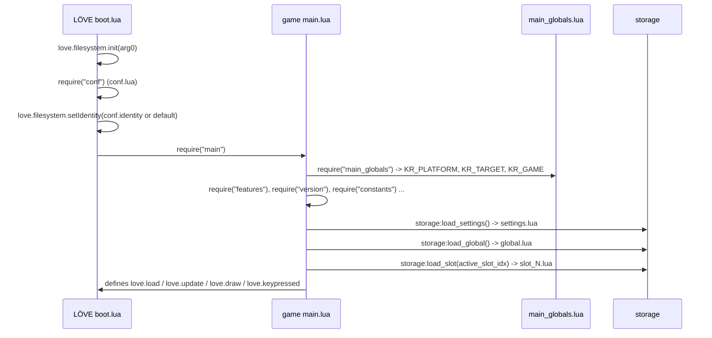
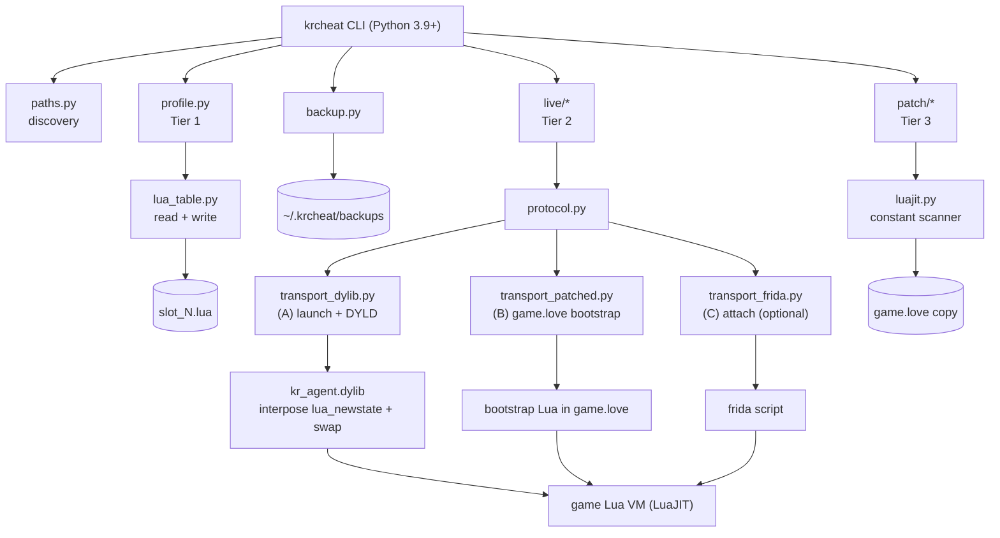

# krcheat — Foundation Document

**Project:** `krcheat` — a command-line trainer and save editor for *Kingdom Rush* on macOS
**Status:** specification / pre-implementation
**Revision date:** 2026-09-16
**Target build analysed:** Kingdom Rush `kr1-desktop-6.4.46` (Steam appid `246420`), macOS 15.7.9 x86_64

> This document is the canonical reference for the project. It consolidates every measured
> finding, the reverse-engineering results, the specification of the target system's runtime
> and persistence model, the design of the tool, the CLI contract, the safety model and the
> open questions. [`MACOS_TRAINER_PROPOSAL.md`](MACOS_TRAINER_PROPOSAL.md) is the earlier,
> shorter proposal and is superseded by this document where they disagree.

---

## Table of contents

1. [Purpose and scope](#1-purpose-and-scope)
2. [Executive summary](#2-executive-summary)
3. [Target application profile](#3-target-application-profile)
4. [Game code architecture](#4-game-code-architecture)
5. [Persistence model specification](#5-persistence-model-specification)
6. [Runtime state specification](#6-runtime-state-specification)
7. [Extension surface: what we can hook](#7-extension-surface-what-we-can-hook)
8. [Feature specification](#8-feature-specification)
9. [Architecture specification](#9-architecture-specification)
10. [CLI specification](#10-cli-specification)
11. [Live channel specification](#11-live-channel-specification)
12. [Save codec specification](#12-save-codec-specification)
13. [Module specification](#13-module-specification)
14. [Bytecode patcher specification](#14-bytecode-patcher-specification)
15. [Safety model](#15-safety-model)
16. [Testing and verification plan](#16-testing-and-verification-plan)
17. [Roadmap](#17-roadmap)
18. [Risk register](#18-risk-register)
19. [Open questions](#19-open-questions)
20. [Non-goals](#20-non-goals)
21. [Appendices](#21-appendices)

---

## 1. Purpose and scope

`krcheat` is a from-scratch macOS replacement for the existing Windows WinForms trainer in this
repository. It targets:

* **"Gold"** — unlimited gold during a level
* **"Health"** — unlimited lives (the Windows trainer's "Health" is the level life counter)
* **"Upgrades"** — unlocking tower/spell upgrades (the Windows trainer's `65`-star button)

and, because the macOS target is a Lua game rather than a compiled Unity binary, a superset of
extra capabilities at low marginal cost.

**In scope:** a Python 3 CLI, a save-file editor, a runtime Lua channel, optional offline
bytecode patching, packaging, tests, documentation.

**Out of scope:** a GUI, multiplayer (the game is single-player), DRM circumvention, asset
redistribution, Windows/Unity support.

---

## 2. Executive summary

The Windows trainer resolves `mono.dll`-relative pointer chains and blind-writes integers
(§Appendix A.1). **None of that transfers to macOS**: the macOS build is a completely different
engine, and the Mac game is not compiled in the sense the Windows one is.

| Dimension | Windows build | macOS build |
| --- | --- | --- |
| Engine | Unity | **LÖVE (Love2D) 0.10.1** |
| Language runtime | Mono / .NET IL | **LuaJIT 2.1** (Lua 5.1) |
| Game logic | compiled IL in assemblies | **555 Lua modules**, shipped as LuaJIT bytecode inside a ZIP |
| Trainer technique | external process memory write | save-file edit + in-process Lua evaluation |
| Achievable precision | pointer chains that break on updates | **name-based** field access that survives updates |

Three consequences drive the whole design:

1. **The save files are plain-text Lua tables** (`~/Library/Application Support/kingdom_rush/slot_N.lua`).
   Editing them requires no injection, no root and no compiler, and yields persistent
   progression changes (upgrades, stars, gems, hero XP, achievements).
2. **The bundle is signed with permissive entitlements** (`allow-dyld-environment-variables`,
   `disable-library-validation`) and **exports the full Lua C API** from `Lua.framework`.
   Therefore an in-process agent can evaluate arbitrary Lua inside the running game — a
   general-purpose trainer rather than a blind integer writer.
3. **Field access is by name, not by address**, so the trainer does not break when the game
   updates (a weakness of the original: hard-coded `mono.dll+0x1F2680` chains).

---

## 3. Target application profile

### 3.1 Installation and identity

| Property | Value | Source |
| --- | --- | --- |
| Install path | `~/Library/Application Support/Steam/steamapps/common/Kingdom Rush/Kingdom Rush.app` | filesystem |
| Steam appid | `246420` | `steamapps` layout, `userdata/<account-id>/246420/` |
| Bundle id | `com.ironhidegames.kingdomrush.mac.steam` | `Contents/Info.plist` |
| Bundle version | `6.4.46` (build `46`) | `Contents/Info.plist` |
| Game version string | `kr1-desktop-6.4.46` | `version.lua` constants |
| LÖVE identity | `kingdom_rush` | `version.lua` constants; confirmed by save directory name |
| Display title | `Kingdom Rush` | `version.lua` (`title`) |
| Release flag | `RELEASE` | `version.lua` (`build`) |

`version.lua` also defines `bundle_keywords`, `bundle_id`, `string_short`, `-mac-steam`.

### 3.2 Engine and VM

| Property | Value | Source |
| --- | --- | --- |
| Framework | **LÖVE 0.10.1** | `love.framework/Versions/A/Resources/Info.plist` → `CFBundleShortVersionString = 0.10.1`, `CFBundleIdentifier = love2d.love` |
| Framework binary | `Frameworks/love.framework/Versions/A/love` (Mach-O) | `otool -L` |
| Script VM | **LuaJIT 2.1.0** | `Lua.framework/.../Info.plist` → `CFBundleIdentifier = LuaJIT.LuaJIT`, `CFBundleShortVersionString = 2.1.0` |
| LuaJIT internal version | `LuaJIT 2.1.1700008891`, Lua 5.1 semantics | `strings Lua.framework` |
| Executable | `Contents/MacOS/love` | `Info.plist` → `CFBundleExecutable = love` |
| Signature type | `CFBundleSignature = LoVe`, `PkgInfo = APPLLoVe` | bundle metadata |
| Architecture | Mach-O universal: `x86_64` + `arm64` | `file Contents/MacOS/love` |
| Host arch | `x86_64` (macOS 15.7.9) | `uname -m`, `sw_vers` |

Because LÖVE 0.10.1 is the runtime, the runtime contract documented in §7 and §12 is the
*shipped* LÖVE behaviour, not a guess: the embedded `boot.lua` is readable as plaintext inside
`love.framework` (§Appendix A.5).

### 3.3 Bundle contents

```
Kingdom Rush.app/Contents/
├── MacOS/love                          # LÖVE player, universal binary
├── Info.plist                          # com.ironhidegames.kingdomrush.mac.steam, 6.4.46
├── PkgInfo                             # APPLLoVe
├── _CodeSignature/CodeResources
├── Resources/
│   ├── game.love                       # 358 MB ZIP — ALL game code + assets
│   ├── kr1.icns, Assets.car, OS X AppIcon.icns
│   └── license.txt, license-kr-desktop.txt
└── Frameworks/
    ├── love.framework                  # LÖVE 0.10.1
    ├── Lua.framework                   # LuaJIT 2.1.0  (exports full Lua C API)
    ├── SDL2.framework                  # windowing / GL context / events
    ├── OpenAL-Soft.framework, Vorbis.framework, Theora.framework, Ogg.framework
    ├── FreeType.framework, libmodplug.framework
    ├── libsteam_api.dylib              # Steamworks
    └── libkcolorspace.dylib, libkhttps.dylib, libkrequest.dylib   # Ironhide "k*" libs
```

`features.lua` declares the enabled platform services for this flavour:
`platform_services` (`news`, `news_store`, `steam`), `news_ih`, `http`, `achievements`
(with `app_id`), and `libs` = `steam_api`, `khttps`, `krequest`, `kcolorspace`, `_ft`.

### 3.4 Code signature entitlements

```
com.apple.security.cs.allow-dyld-environment-variables    true
com.apple.security.cs.allow-jit                           true
com.apple.security.cs.allow-unsigned-executable-memory    true
com.apple.security.cs.disable-library-validation          true
com.apple.security.device.audio-input                     true
```

Implications:

* unsigned / third-party dylibs **may** be loaded (`disable-library-validation`);
* `DYLD_*` environment variables **are honoured** (`allow-dyld-environment-variables`).

Together these permit `DYLD_INSERT_LIBRARIES` injection at launch **without root, without
re-signing the game, and without disabling SIP**, which is the basis of live transport A (§9.3).

### 3.5 Save data location

| Path | Contents |
| --- | --- |
| `~/Library/Application Support/kingdom_rush/slot_%d.lua` | player profile slots (`SLOT_FILE_FMT = "slot_%d.lua"`) |
| `~/Library/Application Support/kingdom_rush/settings.lua` | video/audio/locale settings |
| `~/Library/Application Support/kingdom_rush/global.lua` | first-launch time, session count, news state |
| `~/Library/Application Support/kingdom_rush/steam_autocloud.vdf` | Steam cloud pointer |

Observed on the reference machine: `slot_1.lua` (7091 bytes), `settings.lua`, `global.lua`.

**Steam Cloud is enabled** for this title: `userdata/<account-id>/246420/remotecache.vdf` lists
`kingdom_rush/slot_1.lua` with `syncstate = 1`. This is a first-class hazard for a save editor
and is handled in §15.

---

## 4. Game code architecture

### 4.1 Archive layout

`Contents/Resources/game.love` is a ZIP archive: **1476 entries, 555 `.lua` entries**, of which
**326 are code modules** and **229 are asset metadata modules** under `_assets/kr1-desktop/`
(`images/`, `sounds/`, `strings/`). All are LuaJIT bytecode.

### 4.2 Module map

| Group | Count | Contents |
| --- | --- | --- |
| `kr1/` | 183 | Kingdom Rush 1 content: `game_scripts.lua`, `game_templates.lua`, `game_settings.lua`, `upgrades.lua`, `achievements_handlers.lua`, `data/levels/*`, `data/waves/*` |
| `all/` | 62 | engine-agnostic game framework: `game.lua`, `systems.lua`, `scripts.lua`, `storage.lua`, `storage_mappings.lua`, `constants.lua`, `debug_tools.lua`, platform services |
| `lib/` | 37 | third-party + Ironhide libraries: `hump/*`, `klove/*`, `klua/*`, `serpent.lua`, `json.lua`, `middleclass.lua`, `md5.lua`, `xmlSimple.lua`, `plc/*` |
| `kr1-desktop/` | 25 | desktop flavour: `game_gui.lua`, `screen_map.lua`, `screen_slots.lua`, `data/*`, `dotnet_slot_parser.lua` |
| `all-desktop/` | 13 | desktop platform services and screens |
| root | 6 | `main.lua`, `conf.lua`, `main_globals.lua`, `version.lua`, `features.lua`, `log_levels_release.lua` |

### 4.3 Boot sequence

Reconstructed from `main.lua` constants, `main_globals.lua`, `all/storage.lua` and the embedded
LÖVE `boot.lua`:



Relevant facts:

* `main.lua` contains the string `main_globals` ⇒ it is `require`d by name (line 530 of its
  constant pool). This matters for the "shadow module" experiment (§19 H1).
* `main.lua` references `run`, `present`, `timer`, `update`, `draw`, `keypressed` ⇒ **the game
  may install its own main loop** rather than relying solely on LÖVE's default `love.run`.
  This affects which per-frame hook is safest (§7.3).
* `main.lua` references `DEBUG` and `RELEASE`; `log_levels_release.lua` merely configures
  `klua.log` levels for release builds, so the shipped build runs with `DEBUG` false and the
  `all/debug_tools.lua` module inert.

### 4.4 Notable subsystems

| Module | Relevance to the trainer |
| --- | --- |
| `all/game.lua` | declares the live level state fields `player_gold`, `lives`, `lives_left`, `stars`, `health`, `game_outcome`, `restart_count`. Contains the debug string `"z/Z: time warp (%sx)"` and `"Lives checking OFF (store.game_outcome set)"` |
| `all/systems.lua` | contains `initial_gold`, `initial_lives`, `player_gold`, `lives`, endless-mode scoring and rewards |
| `all/scripts.lua` | per-entity scripts; references `player_gold`, `health` |
| `all/storage.lua` | the persistence layer: load/save/commit, slot validation, progress computation |
| `all/storage_mappings.lua` | declarative mapping table between persisted keys and runtime state |
| `all/debug_tools.lua` | shipped debug toolkit: entity dumps (`getdump`, `getfulldump`), `hide-gui`, `game-victory`, `game_outcome`, wave/level helpers, `keyseq`/`keypressed` handling |
| `all/constants.lua` | signal names (`SGN_*`), `GAME_MODE_*` (CAMPAIGN/HEROIC/IRON/ENDLESS), `DIFFICULTY_*` (EASY/NORMAL/HARD/IMPOSSIBLE), `MOD_TYPE_*`, ad types |
| `lib/json.lua` | JSON encoder/decoder shipped with the game — used for the live channel's wire format (§11.4) |
| `lib/serpent.lua`, `lib/klua/persistence.lua` | save (de)serialisation |
| `lib/klua/dump.lua` | table dumping — useful for `krcheat live probe` |
| `lib/klove/simulation.lua`, `lib/klove/input_state_machine.lua` | simulation/input cores |

---

## 5. Persistence model specification

### 5.1 Storage layer API (`all/storage.lua`)

Recovered constant pool (abridged, in order):

```
load_file / write_file / remove_file        # low-level, via `sio`
SETTINGS_FILE, SETTINGS_PARAMS
GLOBAL_FILE
new_slot, delete_slot, load_slot, save_slot, commit
SLOT_FILE_FMT, SLOT_MANDATORY_KEYS, SLOT_ADDITIONAL_DATA
active_slot_idx, "slot %s must exist before setting it as active"
"loaded slot %s has invalid data for %s. removing."
"hero %s skill %s outside valid range... patching to 0"
"adding missing hero %s to savegame"
"error saving slot %s", "slot-saved", "saving slot:%s should sync:%s"
get_slot_progress, get_challenge_progress
max_stars, crowns, gems, challenges_completed, num_heroic, num_iron, last_level, last_victory
```

Behavioural rules that the editor must respect:

| Rule | Consequence for `krcheat` |
| --- | --- |
| Slots are validated against `SLOT_MANDATORY_KEYS`; on mismatch the game logs *"loaded slot %s has invalid data for %s. removing."* and **deletes the slot** | never remove or rename top-level keys; only add expected keys or modify values |
| Missing heroes are re-added from the template (*"adding missing hero %s"*) | the editor must not delete `heroes.status.*` entries |
| Out-of-range hero skills are clamped to 0 | values written for `heroes.status.<h>.skills.<s>` must be within the game's valid range |
| Data is loaded with `loadstring` + `setfenv` and the chunk's **return value** is used | the file must be a valid Lua chunk returning a table |
| Save is written through `sio` (Ironhide `klua.persistence`) | see §12 for the exact output grammar |
| `should_sync` is passed to `write_lua` | Steam Cloud sync is part of the write path |

Progress values (`max_stars`, `crowns`, `num_heroic`, `num_iron`, `challenges_completed`) are
**derived** by `get_slot_progress` from `levels`; they are not stored. Therefore "give me N
stars" is implemented by writing `levels`, not a counter — this is why the Windows trainer's
`Upgrades = 65` maps to *"set `upgrades.*` to max"* on macOS (§8).

### 5.2 File format

`slot_%d.lua`, `settings.lua` and `global.lua` are all produced by the same serializer
(`lib/klua/persistence.lua`, a serpent-derived writer). Two shapes exist:

```lua
-- simple (no shared references) — the shape observed for slot_1.lua
local obj1 = {
	["key"] = value;
}
return obj1
```

```lua
-- with shared references (emitted only when the table graph has aliases)
local multiRefObjects = {
} -- multiRefObjects
local obj1 = { ... }
return obj1
```

Grammar constraints observed: tab indentation, `["key"] = value;` / `[n] = value;` entries,
`;` terminators, `true`/`false` booleans, decimal numbers (including full-precision floats such
as `0.021276595744681`), quoted strings. No functions, no comments, no `nil` entries.

### 5.3 Slot schema (measured from `slot_1.lua` v6.4.46)

| Key | Type | Semantics | Notes |
| --- | --- | --- | --- |
| `version_string` | string | `"kr1-desktop-6.4.46"` | preserve verbatim; used for save migration |
| `gems` | number | premium currency balance | observed `4154` |
| `difficulty` | number | last-used difficulty | observed `1`; see `DIFFICULTY_*` |
| `upgrades` | table<string, number> | purchased upgrade level per category | `archers`, `barracks`, `engineers`, `mages`, `rain`, `reinforcements`; observed 4/4/3/3/5/5 |
| `levels` | table<number, table> | per-level progress | keyed by level id; see §5.4 |
| `heroes.selected` | string | currently selected hero id | e.g. `hero_magnus` |
| `heroes.status.<hero>.xp` | number | hero experience | observed 0 for all |
| `heroes.status.<hero>.skills` | table | per-skill state | empty tables in the observed save |
| `achievements` | table<string, bool> | achievement unlocked flags | 44 entries observed, 74 defined |
| `achievement_counters` | table<string, number> | progress counters | e.g. `DIE_HARD = 159813` |
| `seen` | table<string, bool> | "already seen" flags for encyclopedia entries, tips, enemy/tower introductions | drives notification suppression |
| `bag` | table | inventory (consumables) | empty in the observed save |

### 5.4 `levels` semantics

```lua
["levels"] = {
    [1]  = { [1] = 1; [2] = 1; [3] = 1; ["stars"] = 3 };
    [14] = { };
    [23] = { };
    [81] = { ... };
}
```

* Level ids observed in content: **1–26** plus **81** (endless "orcs"); endless maps reference
  level `82` (endless "twilight") in the mapping table but no `level82` module ships.
* The `[1]`, `[2]`, `[3]` sub-keys are **mode/difficulty indices**. Evidence: the leaderboard
  mappings in `all/storage_mappings.lua` bind
  `levels[81][1].high_score` ↔ `endless_orcs_casual.score`,
  `[2]` ↔ `endless_orcs_normal`, `[3]` ↔ `endless_orcs_veteran`, while `all/constants.lua`
  defines `GAME_MODE_CAMPAIGN`, `GAME_MODE_HEROIC`, `GAME_MODE_IRON`, `GAME_MODE_ENDLESS`.
  So for story levels the three slots are campaign/heroic/iron; for endless levels they are
  casual/normal/veteran.
* `stars` is the per-level star total displayed on the map.
* Endless levels additionally use `high_score` and `waves_survived` keys.

### 5.5 Mapping table (`all/storage_mappings.lua`)

A declarative `src -> dst` list, evaluated with `do_row`/`pp_token`, combining a runtime
source path and a persisted destination path. Representative bindings:

| Runtime path | Persisted path |
| --- | --- |
| `notifications.notificationEnemyYeti` | `seen.enemy_yeti` |
| `notifications.notificationTowerMagesArcane` | `seen.tower_arcane_wizard` |
| `achievements.svEnemiesFallenCount` | `achievement_counters.ISTHATWILHELM` |
| `heroes_config.hero_malik.skills[1]` | `heroes.status.hero_malik.skills.<skill>` |
| `heroes_config.hero_malik.currentXP` | `heroes.status.hero_malik.xp` |
| `leaderboards.savedScores.endless_orcs_veteran.score` | `levels[81][3].high_score` |
| `leaderboards.savedScores.endless_orcs_veteran.maxWave` | `levels[81][3].waves_survived` |

The table is grouped per platform/target (`KR_TARGET` = `desktop`/`tablet`/`phone`,
`KR_PLATFORM` = `mac`/`ios`/`android`) and includes slot families `slot_common`, `slot_`,
`slot_kr1_endless`, `slot_kr2`, `slot_kr3`, `slot_kr3_endless` — i.e. **additional slot files
exist beyond `slot_1.lua`** and the CLI must discover `slot_*.lua` dynamically rather than
assuming a fixed set.

### 5.6 Settings and global files

`settings.lua` (measured):

```lua
fps = 60; fullscreen = false; height = 800; width = 1280; highdpi = true;
large_pointer = false; locale = "zh-Hans"; msaa = 0; pause_on_switch = false;
texture_size = "ipad"; timestamp = …; volume_fx = …; volume_music = …; vsync = false
```

`global.lua` (measured):

```lua
first_launch_time = …; marketing = { session_count = 9 };
news = { last_refresh_id = …; last_seen_time = …; mark_seen_time = … }
```

`SETTINGS_PARAMS` in `all/storage.lua` validates settings keys; the settings file is out of
scope for cheating but is read by `krcheat doctor` to detect locale/target (`texture_size`
selects the `_assets` variant).

---

## 6. Runtime state specification

### 6.1 Identifiers known to exist

Mined from module constant pools (`strings`), i.e. names that definitely appear as Lua string
constants in the shipped bytecode:

| Identifier | Module | Meaning |
| --- | --- | --- |
| `player_gold` | `all/game.lua`, `all/systems.lua`, `all/scripts.lua`, `all-desktop/game_gui.lua` | current gold in level |
| `initial_gold` | `all/systems.lua` | level start gold |
| `lives`, `lives_left`, `initial_lives` | `all/game.lua`, `all/systems.lua` | level life counter |
| `health` | many | entity/tower health (per-entity, not the level counter) |
| `stars` | `all/game.lua`, `all/storage_mappings.lua` | per-level star total (persisted) |
| `game_outcome` | `all/game.lua`, `all/debug_tools.lua` | win/lose flag; disabling it disables life checking |
| `restart_count`, `restarted` | `all/game.lua` | restart bookkeeping |
| `keep_gold` | `kr1/game_templates.lua` | per-entity flag to retain gold |
| `level_mode`, `level_idx`, `level_difficulty` | `all/debug_tools.lua`, `all/storage.lua` | current level identity |
| `max_upgrade_level`, `locked_towers`, `locked_powers`, `locked_hero` | `kr1/data/levels/*_data.lua` | per-level restrictions |

### 6.2 Access path — what is known and what is not

**Known:** the field names, and that `all/debug_tools.lua` accesses them as
`store.game.<field>` (the module references both `store` and `game` and then `lives_left`,
`game_outcome`), and that `all/storage.lua` reads `levels`, `stars`, `last_level`,
`last_victory` via `get_slot_progress`.

**Not yet verified:** the exact global owner chain (e.g. whether the live object is reachable as
`GAME`, `store.game`, or via a `director`/`gamestate` handle), and its field names at runtime.
This is deliberately **not hard-coded**: `krcheat live probe` enumerates the global environment
and the candidate tables at runtime and reports reachable paths, and the snippet library is
built from that output (§11.5). This is the single most important step of milestone M0.

### 6.3 Speed / time warp

`all/game.lua` contains the debug strings `"z/Z: time warp (%sx)"` and
`"Lives checking OFF (store.game_outcome set)"`. This indicates (inference, to be confirmed by
`probe`) that the debug build exposes a simulation speed multiplier and a life-check toggle.
If they exist in the release build as plain fields, they are the cleanest way to implement
speed-up and god-mode without touching entity health.

---

## 7. Extension surface: what we can hook

### 7.1 Lua C API

`Frameworks/Lua.framework/Versions/A/Lua` exports **87 `lua_*` / `luaL_*` symbols**. Verified
present and directly usable by an injected agent:

```
luaL_loadstring, luaL_loadbuffer, luaL_loadbufferx,
lua_pcall, lua_call, lua_getfield, lua_setfield, lua_gettable,
lua_pushnumber, lua_pushstring, lua_tonumber, lua_tonumberx, lua_tolstring,
lua_type, lua_typename, lua_gettop, lua_settop, lua_next,
lua_createtable, lua_gc, lua_close, lua_dump, lua_getfenv, lua_getinfo, lua_getlocal, …
```

Because LuaJIT exposes `luaL_loadstring`, an agent can compile and run **arbitrary Lua source**
inside the game process.

### 7.2 Getting the `lua_State*`

LÖVE 0.10.1 creates exactly one main state. The proposed capture strategy is to interpose the
state constructor (`luaL_newstate` / `lua_newstate`) via a `__DATA,__interpose` section, which
requires no symbol patching and no root.

### 7.3 Getting a safe execution window

Lua states are not thread-safe; the snippet must run **on the game's own Lua thread while the VM
is idle**. Candidates, in order of preference:

| Candidate | Rationale | Status |
| --- | --- | --- |
| `SDL_GL_SwapWindow` | exported by `SDL2.framework` (verified: `T _SDL_GL_SwapWindow`), called once per presented frame by LÖVE's OpenGL path, on the main thread, with the VM idle | **recommended** |
| `love.graphics.present` (`love::graphics::Graphics::present`) | called once per frame by LÖVE's default `love.run` (verified in the embedded `boot.lua`: `love.graphics.present()`), but is redefinable from Lua | fallback |
| `SDL_PollEvent` | exported (verified: `T _SDL_PollEvent`), called multiple times per frame in `love.event.poll()` | fallback |
| `love.timer.step` | called by `love.run` and by most custom loops | fallback (Lua level) |

Note that `main.lua` references `run` and `present`, so the game may replace `love.run`; a
C-level hook (`SDL_GL_SwapWindow`) is therefore the more robust choice. The agent should try
candidates in order and log which one succeeded.

### 7.4 Toolchain availability (reference machine)

| Tool | Status |
| --- | --- |
| `clang` | `/usr/bin/clang` — Apple clang 17.0.0, target `x86_64-apple-darwin24.6.0` |
| `codesign` | `/usr/bin/codesign` (for ad-hoc signing the agent dylib) |
| Xcode CLT | `/Library/Developer/CommandLineTools` |
| `python3` | `3.9.6` (pyenv shim; also `/usr/bin/python3`) |
| `frida` | **not installed** (only relevant to the optional transport C) |

`python3 3.9` sets the language floor: the CLI must be **Python 3.9 compatible** (no `match`,
no `X | Y` type unions at runtime without `from __future__ import annotations`, etc.).

---

## 8. Feature specification

### 8.1 Feature map

| ID | Feature | Original equivalence | Mechanism | Tier |
| --- | --- | --- | --- | --- |
| F1 | Set/infinite **gold** in the current level | "Gold" checkbox | live channel, `player_gold` | 2 |
| F2 | Set/infinite **lives** in the current level | "Health" checkbox | live channel, `lives`/`lives_left` | 2 |
| F3 | **Unlock all upgrades** | "Upgrades = 65" button | save file, `upgrades.*` | 1 |
| F4 | **Set stars** for all levels / a level | (alternative to F3) | save file, `levels[n].stars` | 1 |
| F5 | Set **gems** | new | save file, `gems` | 1 |
| F6 | Set **hero XP / skills** | new | save file, `heroes.status.*` | 1 |
| F7 | Unlock all **achievements** (in-game flags) | new | save file, `achievements.*` | 1 |
| F8 | Unlock all **`seen`** entries (encyclopedia/notifications) | new | save file, `seen.*` | 1 |
| F9 | **Game speed** multiplier | new | live channel | 2 |
| F10 | **God mode** (disable life checking) | new | live channel, `game_outcome` | 2 |
| F11 | **Arbitrary Lua evaluation** | new | live channel | 2 |
| F12 | **State probe/discovery** | new | live channel | 2 |
| F13 | Offline **bytecode patching** (permanent tweaks) | new | `game.love` copy | 3 |
| F14 | **Backup / restore / doctor** | new | filesystem | 1 |

### 8.2 Acceptance criteria

* **F1/F2** — with the game running in a level, `krcheat live gold infinity` makes the gold
  counter stop decreasing and new towers become affordable within one frame; `krcheat live
  gold off` restores normal behaviour; the value is *not* persisted to the save file.
* **F3** — after `krcheat profile set upgrades all=5` and a game restart, the upgrade screen
  shows every upgrade purchased, with no invalid-slot warning in the game log.
* **F4** — after `krcheat profile set stars all`, the map screen shows the maximum star count
  and the "stars earned" totals on the map reflect it.
* **F5–F8** — the corresponding UI counters change after restart; the game does not delete the
  slot.
* **F14** — every mutating command produces a restorable backup, and `krcheat backup restore`
  returns the file to a byte-identical state.
* **All tier-1 commands** must work with **no** compiler, no root, no injection, and while the
  game is not running.

---

## 9. Architecture specification

### 9.1 Component overview



### 9.2 Tier 1 — save editor (no injection)

Pure Python, stdlib only. Responsibilities: discover the save directory and slots, read and
write the Lua-table format faithfully, validate against the schema, back up, and expose the
profile operations of §8.1 (F3–F8, F14). This is the first shippable milestone because it
cannot corrupt anything permanently (backups + atomic writes) and needs no privileges.

### 9.3 Tier 2 — live channel

**Transport A (primary): launch-time dylib injection.**

```
DYLD_INSERT_LIBRARIES=<path>/kr_agent.dylib \
SteamAppId=246420 \
"<...>/Kingdom Rush.app/Contents/MacOS/love"
```

The agent is a small C dylib that:

1. `dlopen`s `Lua.framework` (or resolves symbols via `RTLD_DEFAULT` after LÖVE loads it);
2. interposes `luaL_newstate`/`lua_newstate` to capture the `lua_State *`;
3. interposes `SDL_GL_SwapWindow` (fallbacks `SDL_PollEvent`, `Graphics::present`) to obtain a
   once-per-frame callback on the main thread;
4. on each tick, checks the command channel; if a request is pending, runs it with
   `luaL_loadstring` + `lua_pcall` and writes the response;
5. maintains a persistent "always-on" snippet for `infinity` modes, re-applied each frame.

Pros: does not modify the game installation at all; no root; no signature invalidation; the
game can be launched with or without cheats by the CLI. Cons: requires `clang` once, and the
game must be started by the CLI (Steam overlay/cloud sync are inactive — which is *safer* for
save editing). The dylib should be ad-hoc signed (`codesign -s -`) so it also works on
Apple-silicon hosts, where unsigned arm64 dylibs are rejected.

**Transport B (no-compiler fallback): patch `game.love`.**

`game.love` is a ZIP. Replace the bytecode `main_globals.lua` (119 bytes; its entire constant
pool is `KR_PLATFORM="mac"`, `KR_TARGET="desktop"`, `KR_GAME="kr1"`) with an equivalent **Lua
source** module that also installs a bootstrap (command-file poller on a per-frame Lua hook).
Repack the archive, keeping a pristine copy for `krcheat repair`. Then the game can be launched
normally from Steam and the live channel still works.

Pros: no compiler, no injection, works with a normal Steam launch, doubles as a modding
platform. Cons: modifies game files; "Verify integrity of game files" reverts it (the CLI can
re-apply); assumes `main_globals` is required by name (verified present in `main.lua`) and that
a stable per-frame Lua hook exists.

**Transport C (optional): attach to a Steam-launched process** via `frida`. Requires
`pip install frida` and, in practice, `sudo` on macOS. Last resort.

All three share the protocol of §11, so the CLI is written once and the transport is a
configurable strategy.

### 9.4 Tier 3 — offline bytecode patching (optional/experimental)

See §14.

---

## 10. CLI specification

Entry point: `krcheat` (installed via `pipx`/`pip`, or `python -m krcheat`).

Global options:

```
--game PATH        override app bundle path
--save-dir PATH    override save directory
--slot N           profile slot (default: active/highest slot)
--json             machine-readable output
--dry-run          show what would change, write nothing
--yes              assume yes for confirmations
--verbose / -v     debug logging to stderr
--version, --help
```

### 10.1 Environment and diagnostics

| Command | Behaviour |
| --- | --- |
| `krcheat doctor` | verifies: app bundle found, version, save dir present and writable, save parses, Steam Cloud state, running process, agent availability (dylib built? clang present?), and prints a summary with pass/fail per check |

### 10.2 Profile (Tier 1)

| Command | Behaviour |
| --- | --- |
| `krcheat profile show [--json]` | pretty-print the parsed profile: gems, difficulty, upgrades, stars per level, hero XP, achievement counts |
| `krcheat profile get <path>` | dotted/indexed path read, e.g. `levels.1.stars`, `heroes.status.hero_malik.xp` |
| `krcheat profile set gems <n>` | set premium currency |
| `krcheat profile set difficulty <n>` | set last difficulty (1–4 per `DIFFICULTY_*`) |
| `krcheat profile set upgrades all=<n>` | set every upgrade category |
| `krcheat profile set upgrades <cat>=<n>` | set one of `archers`, `barracks`, `engineers`, `mages`, `rain`, `reinforcements` |
| `krcheat profile set stars all [--stars N]` | mark every level complete with N stars in all modes |
| `krcheat profile set level <n> stars <n> [--mode campaign\|heroic\|iron]` | per-level tuning |
| `krcheat profile set level <n> clear --mode <m>` | clear completion flags |
| `krcheat profile set hero <id> xp <n>` | hero experience |
| `krcheat profile set hero <id> skills all=<n>` | all skills (`skills` are keyed by skill *name*, resolved from the mapping table; values are clamped by the game) |
| `krcheat profile set achievements all\|none\|<ID>[,<ID>…]` | achievement unlock flags |
| `krcheat profile set counters <ID> <n>` | achievement counters |
| `krcheat profile set seen all` | mark every `seen.*` entry true |
| `krcheat profile list achievements\|heroes\|levels\|upgrades` | enumerate the known ids (mined from the archive's bytecode constant pool) |

### 10.3 Live (Tier 2)

| Command | Behaviour |
| --- | --- |
| `krcheat play [--no-cheats] [-- steam-args…]` | launch the game (Transport A) with the agent loaded |
| `krcheat install` / `krcheat uninstall` | install/remove the Transport B bootstrap; `uninstall` also removes the dylib |
| `krcheat repair` | re-apply Transport B after a Steam integrity check or game update |
| `krcheat live status` | channel health: agent present, hook in use, game state, current overrides |
| `krcheat live probe [--out FILE]` | enumerate globals/tables and dump the reachable state paths (uses the game's `lib/json.lua` for encoding) |
| `krcheat live gold <n\|infinity\|off>` | one-shot value, per-frame override, or release |
| `krcheat live lives <n\|infinity\|off>` | ditto |
| `krcheat live speed <n\|off>` | simulation multiplier (`time warp`) |
| `krcheat live god on\|off` | disable life checking (`game_outcome`) |
| `krcheat live eval "<lua>"` | evaluate an arbitrary snippet and print the JSON result |
| `krcheat live watch` | interactive prompt evaluating snippets until Ctrl-D |

### 10.4 Patching and backup

| Command | Behaviour |
| --- | --- |
| `krcheat backup create [--label L]` / `list` / `restore <id>` / `prune --keep N` | backups of save files and (for Tier 2B/3) the game archive |
| `krcheat patch scan <value> [--module PATH] [--type number\|int]` | find constants equal to a value in a module's bytecode (e.g. `265`, `20`) |
| `krcheat patch apply --dry-run` / `--yes` | write a patched copy of the archive |
| `krcheat patch restore` | restore the pristine archive |

### 10.5 Exit codes

| Code | Meaning |
| --- | --- |
| 0 | success |
| 1 | usage error |
| 2 | game/app/save not found |
| 3 | channel unavailable (game not running / agent absent) |
| 4 | validation failure (schema, mandatory keys, out-of-range value) |
| 5 | backup or restore failure |
| 6 | internal error |

---

## 11. Live channel specification

### 11.1 Transport independence

The CLI depends only on a `LiveTransport` interface:

```python
class LiveTransport(Protocol):
    def available(self) -> bool: ...
    def start(self, launch: bool) -> None: ...
    def stop(self) -> None: ...
    def request(self, code: str, timeout: float = 2.0) -> Response: ...
```

Implementations: `DylibTransport` (A), `PatchedLoveTransport` (B), `FridaTransport` (C).
Selection order is configurable via `--transport`.

### 11.2 Message format

Request (Lua source to evaluate, plus correlation and mode):

```json
{ "id": 42, "mode": "once", "code": "return json.encode({ gold = GAME.player_gold })" }
```

`mode` is one of:

| Mode | Semantics |
| --- | --- |
| `once` | evaluate now, return the result |
| `always` | evaluate every frame until replaced or cleared (the "infinity"/checkbox behaviour) |
| `clear` | remove a previously registered `always` snippet by key |

Response:

```json
{ "id": 42, "ok": true, "result": "{\"gold\":265}", "error": null, "ms": 0.4 }
```

### 11.3 Channel mechanics

* Directory: `$TMPDIR/krcheat/<gamepid>/` (per-process isolation, auto-cleanable).
* Files: `cmd.json` (request), `out.json` (response), `hb` (heartbeat timestamp), `log` (agent log).
* The agent checks `cmd.json`'s `mtime`/size each frame (a `stat` per frame is negligible),
  executes, writes `out.json` atomically (`write` + `rename`).
* Latency target: one frame (≈16 ms at 60 fps) plus polling; CLI timeout default 2 s.
* A unix socket alternative (`$TMPDIR/krcheat.sock`) may be added later; the file channel is
  chosen first because it is inspectable, survives agent restarts, and needs no cleanup logic.

### 11.4 Result encoding

Responses must be serializable. Rather than implementing a serializer in the agent, the CLI
wraps snippets so that the *snippet itself* encodes the result using the game's own bundled
JSON library:

```lua
local json = require("lib.json")
local out = { ... }              -- whatever we want to report
return json.encode(out)
```

This removes all type-marshalling work from C and Python, and guarantees the encoding matches
the game's data model (`lib/json.lua` is shipped in `game.love`).

### 11.5 Snippet library

Game-specific knowledge lives in Python (`live/snippets.py`) as parameterised Lua templates, so
that discovering a new field or fixing a broken path requires no C/Python logic changes and no
recompilation. Initial set:

| Snippet | Template (illustrative — exact owner paths are filled in after `probe`) |
| --- | --- |
| `gold_inf` | `local s = <owner> s.player_gold = 99999` |
| `lives_inf` | `local s = <owner> s.lives_left = <n>` (and/or `s.lives`) |
| `god_on` | disable life checking via `game_outcome` |
| `speed` | set the `time warp` multiplier |
| `probe` | walk `_G`, `store`, `game`, report table shapes and scalar values |
| `eval` | pass through user-supplied Lua |

A hard rule: snippets must be **non-destructive and reversible**, and must never call
`love.event.quit`, `os.exit`, file I/O outside the channel, or mutate persisted state (tier 1
owns that).

### 11.6 Agent hardening

* Re-entrancy guard (never evaluate while a snippet is running, including from the hook).
* Size cap on `cmd.json` (e.g. 64 KiB).
* All agent I/O wrapped so a failure cannot take down the game: on error, log and continue.
* The agent never blocks the main thread: it reads/writes files, never waits.
* Overrides are cleared on level change detection (configurable) to avoid surprising carry-over.

---

## 12. Save codec specification

### 12.1 Reader

Input subset (everything the game emits):

```
chunk      := "local obj1 = " table "\nreturn obj1\n"
            | "local multiRefObjects = " table " -- multiRefObjects\n" chunk
table      := "{" (entry)* "}"
entry      := "[" key "]" " = " value ";"
key        := number | string
value      := number | string | boolean | table
string     := '"' (escaped chars) '"'
```

Requirements: preserve numeric keys as integers, string keys as strings, full float precision
(round-trip must be exact — `repr(float)`/`%.17g` style), booleans, empty tables, and
tolerate/ignore the `multiRefObjects` preamble (record its presence so it can be re-emitted
when aliasing exists).

### 12.2 Writer

* Emit exactly the observed style: `local obj1 = {`, tab-indented entries, `["key"] = value;`,
  `[n] = value;`, closing `}`, blank-line-free, `return obj1`.
* Preserve key insertion order as read (the game's serializer sorts; preserving order keeps
  diffs minimal and is safe since the reader does not depend on order).
* Escape strings defensively (`\`, `"`, newline, control chars).
* Emit floats so that re-reading yields the identical value.
* **Validate before swap**: re-parse the generated text with the reader and compare against the
  intended structure; only then write.
* **Atomic write**: write to `slot_N.lua.tmp` in the same directory, `os.replace()` over the
  original. Never truncate the original in place.

### 12.3 Schema validation

* Whitelist of known top-level keys (§5.3) plus preservation of unknown keys read from the file.
* Refuse operations that would delete a mandatory key; refuse to delete `heroes.status.*`.
* Range-check values where the game clamps them (hero skills) and warn rather than silently
  write an out-of-range value.
* Confirm `version_string` matches the installed game version; warn on mismatch.

### 12.4 Post-write verification

After writing, re-read from disk, re-validate, and report a diff summary. `--dry-run` stops
before the write and prints the diff.

---

## 13. Module specification

| Module | Responsibility | Key public API |
| --- | --- | --- |
| `krcheat/cli.py` | argument parsing, command dispatch, exit codes, output formatting | `main(argv) -> int` |
| `krcheat/paths.py` | locate app bundle, `Contents/Resources/game.love`, save dir, slots, running process, Steam userdata | `AppBundle`, `SaveDir`, `find_slots()`, `is_running()` |
| `krcheat/lua_table.py` | reader/writer/validator for the save grammar | `loads(text) -> Table`, `dumps(table) -> str`, `LuaTableError` |
| `krcheat/profile.py` | Tier 1 operations, schema knowledge, id enumeration | `Profile.load()`, `.save()`, `.set_gems()`, `.set_upgrades()`, `.set_stars()`, `.set_hero_xp()`, `.unlock_achievements()` |
| `krcheat/mine.py` | extract ids (achievements, heroes, levels, upgrades, skills) from the archive's bytecode constants | `mine_ids(love_path) -> dict[str, list[str]]` |
| `krcheat/backup.py` | timestamped backups, restore, prune, manifest | `create(paths, label) -> BackupId`, `restore(id)`, `prune(keep)` |
| `krcheat/live/protocol.py` | request/response dataclasses, channel paths, framing | `Request`, `Response`, `ChannelDirs` |
| `krcheat/live/snippets.py` | parameterised Lua templates | `gold_inf(n)`, `lives_inf(n)`, `probe()`, `eval(code)` |
| `krcheat/live/transport_dylib.py` | build/locate agent, launch with `DYLD_INSERT_LIBRARIES`, channel loop | `DylibTransport` |
| `krcheat/live/transport_patched.py` | install/uninstall/repair the bootstrap module in `game.love` | `PatchedLoveTransport` |
| `krcheat/live/transport_frida.py` | optional attach | `FridaTransport` |
| `krcheat/patch/luajit.py` | bytecode constant scanning and patching | `scan(path, value)`, `patch(path, hits)` |
| `krcheat/agent/kr_agent.c` | the injected agent | — |
| `krcheat/agent/Makefile` | `clang -dynamiclib -arch x86_64 -arch arm64` + `codesign -s -` | — |

**Dependency policy:** tiers 1 and 3 use the Python standard library only. Tier 2 adds no Python
dependencies for transports A and B; transport C requires `frida`.

---

## 14. Bytecode patcher specification

**Status: experimental, stretch goal.** Included because the data modules
(`kr1/data/levels/*`, `kr1/data/waves/*`) are pure data and the constants are plaintext, making
a "permanent mod" possible without any runtime channel.

* LuaJIT bytecode header: `1B 4C 4A 02` (magic `ESC` `L` `J`, version `2`).
* String constants are stored as `GCstr` objects with a length prefix followed by the bytes, so
  **names are discoverable by scanning**. Number constants are stored as tagged 8-byte values.
* Patching strategy: locate a candidate constant *by value and by context* (nearest string
  constants / module), verify the byte distance to the enclosing constant-table entry, replace
  the payload in place (same width ⇒ no size or offset changes anywhere in the file), then
  rebuild the ZIP entry.
* Candidate use cases: level starting gold (the Windows trainer's defaults were `265` gold and
  `20` lives), lives per level, wave gold rewards (`kr1/data/waves/levelNN_waves_*.lua`).
* Safety: always operate on a copy; `--dry-run` prints a hex diff; `krcheat patch restore`
  restores the pristine archive; a failed patch must leave the original untouched.
* Validation difficulty: without a standalone LuaJIT 2.1 interpreter available, the patched
  module cannot be loaded out-of-process for a smoke test, so validation relies on structural
  checks plus an in-game test. This is why the tier is marked experimental.

---

## 15. Safety model

| Hazard | Mitigation |
| --- | --- |
| Corrupting the profile (game deletes invalid slots, see §5.1) | timestamped backup before every write; schema validation; re-parse the generated file before swapping; never delete keys |
| Partial write / power loss | write to `.tmp` in the same directory + `os.replace()` (atomic on APFS) |
| **Steam Cloud overwriting local edits** (or uploading cheated saves) | `doctor` detects `remotecache.vdf` and reports cloud state; a warning is emitted before writing when Steam is running; editing while Steam is closed is recommended; a post-restore resync note is printed |
| Steam reverting a patched `game.love` | keep a pristine copy; `krcheat repair` re-applies; `uninstall` restores |
| Breaking the bundle's code signature (Transport B / Tier 3) | prefer Transport A; when modifying resources, note that only the *resource seal* is invalidated (the executable's signature is untouched) and Steam-installed apps are not quarantined, so Gatekeeper does not block launch; the CLI always keeps the pristine archive |
| Crashing the game via a live snippet | snippets are validated and reversible; the agent catches all Lua errors and never re-raises into the game; overrides are explicit and clearable; `live status` always shows what is active |
| Apple-silicon portability | ad-hoc sign the agent dylib (`codesign -s -`); Transport B needs no native code at all |
| Game updates changing field names/paths | no hard-coded addresses anywhere; the channel re-discovers paths via `probe`; tier 1 fails loudly (not silently) if `version_string` differs |
| Accidentally shipping copyrighted content | the repo must never contain extracted game assets or bytecode; only ours |

Operational rules:

1. Any mutating command creates a backup first; if the backup fails, abort (exit 5).
2. `--dry-run` is honoured by every mutating command.
3. The tool never writes to the game bundle unless the user explicitly runs `install`/`patch`.
4. `doctor` must pass before tier-2 commands run.

---

## 16. Testing and verification plan

### 16.1 Pre-implementation spikes (M0)

| ID | Question | Method | Pass criterion |
| --- | --- | --- | --- |
| **S1** | Does the game accept a hand-edited slot? | change `gems` by hand, restart, observe | the new value is displayed; no slot-deleted warning |
| **S2** | Is the save directory searched before the game source for `require` in LÖVE 0.10.1? | drop a shadow `main_globals.lua` (Lua source) into the save dir that writes a marker file | marker file appears ⇒ Transport B becomes a 20-line drop-in instead of a 358 MB repack (see §19 H1) |
| **S3** | Can we load a dylib into the game? | build a hello-world dylib, `DYLD_INSERT_LIBRARIES` launch, log a line | log line present in the agent log file |
| **S4** | Which per-frame hook works? | try `SDL_GL_SwapWindow`, then `SDL_PollEvent`, then `Graphics::present` | a counter reaches ≥ 30 within one second |
| **S5** | Is the main `lua_State` captured by interposing `luaL_newstate`? | log the pointer; sanity-check `lua_gettop` | non-null pointer, `lua_gettop` returns a small sane value |
| **S6** | What is the owner path of `player_gold` / `lives`? | run `probe` and grep the dumped globals | a concrete, reachable path such as `store.game.player_gold` |
| **S7** | Does the game start outside Steam? | launch the executable directly | reaches the main menu (Steam features may be degraded) |

### 16.2 Test layers

* **Unit tests** — `lua_table` round-trip (including full-precision floats, nesting, mixed keys,
  `multiRefObjects` preamble), `backup` create/restore/prune, `mine` id extraction against a
  synthetic bytecode fixture, snippet generation.
* **Golden tests** — a checked-in *synthetic* save file (never a real one) asserting exact
  serialiser output.
* **Integration tests (manual, documented)** — the acceptance criteria of §8.2, each with
  before/after screenshots or log excerpts.
* **Regression guard** — `krcheat doctor` plus a `--self-test` flag that exercises the codec and
  backup paths without touching the game.

### 16.3 Verification evidence to keep

For each milestone, record: game version, command, resulting UI state, and the game's own log
lines (the storage layer logs slot validation failures, which is the most reliable signal that a
write was rejected).

---

## 17. Roadmap

| # | Milestone | Deliverable | Depends on | Effort |
| --- | --- | --- | --- | --- |
| M0 | Spikes S1–S7 | short findings note, decisions recorded in this document | — | 0.5–1 d |
| M1 | **Tier 1 core** | `doctor`, `profile show/get/set`, `backup`, codec + tests | S1 | 1–2 d |
| M2 | **Tier 1 complete** | `mine` id enumeration, all F3–F8 commands, `list` | M1 | 1 d |
| M3 | **Agent** | `kr_agent.c` + Makefile, launch, channel, `probe`, `eval`, `status` | S3–S6 | 2–3 d |
| M4 | **Live features** | `gold`, `lives`, `speed`, `god`, `always` mode | M3 | 1–2 d |
| M5 | **Transport B** | install/uninstall/repair for the `game.love` bootstrap | S2 | 1 d |
| M6 | **Packaging and docs** | `pyproject.toml`, `pipx` install, manpage-style README, troubleshooting | M4 | 0.5–1 d |
| M7 | **Tier 3 (optional)** | bytecode scanner/patcher with dry-run | M4 | 2–3 d |

Ordering rationale: M1 ships user-visible value (F3–F8, i.e. the original trainer's "Upgrades"
feature and more) with zero risk and zero prerequisites; M3–M4 delivers the runtime features
(F1/F2) once the spikes have removed the unknowns.

---

## 18. Risk register

| Risk | Likelihood | Impact | Mitigation |
| --- | --- | --- | --- |
| Live owner path cannot be resolved cleanly (S6 fails) | medium | medium | fall back to (a) a broader `probe` that walks `_G` recursively, (b) `debug.getregistry()`/upvalue inspection from a Lua hook installed at game call sites, (c) enabling the shipped `all/debug_tools.lua` helpers |
| `SDL_GL_SwapWindow` is not called (different presentation path) | low | medium | ordered fallback list (§7.3); worst case a Lua-level hook |
| Game refuses to run outside Steam | low | high for Transport A | set `SteamAppId=246420`; if it still fails, switch to Transport B (normal Steam launch) |
| Steam Cloud clobbers edits | medium | medium | warnings, backups, recommend Cloud off / Steam closed |
| Bundle modifications break launch | low | medium | prefer Transport A; keep pristine copies; documented restore |
| Python 3.9 floor constrains syntax | certain | low | encode the constraint in `pyproject.toml` and CI |
| Field names differ from the bytecode constants (locals vs fields) | medium | low | runtime discovery, not static assumptions |
| Overflowing/clamped values rejected by the game | medium | low | range checks + warnings; re-read after write |
| Terminal tooling unavailable during automation | observed | low | the tool has no runtime dependency on interactive tooling |

---

## 19. Open questions

**H1 — save-directory `require` precedence (LÖVE 0.10.1).** Whether a Lua source file placed in
`~/Library/Application Support/kingdom_rush/` shadows the same-named module inside `game.love`
for `require`. This could not be resolved offline (the LÖVE wiki returns HTTP 403 to this
environment, and the upstream 0.10.1 `Filesystem.cpp` blob could not be extracted in full). If
true, Transport B reduces to dropping one generated file and needs no archive repacking.
Resolve with spike S2.

**H2 — the exact owner chain of the live level state.** See §6.2 / S6.

**H3 — the release-build availability of debug hooks.** `all/debug_tools.lua` and the `time
warp` / `game_outcome` strings exist in the shipped bytecode, but `DEBUG` is false in the
release build. Whether the underlying fields are still present and writable must be checked by
`probe`.

**H4 — semantics of `difficulty = 1`.** Whether the stored value is 1-based over
`DIFFICULTY_EASY|NORMAL|HARD|IMPOSSIBLE`, or offset. Verify by setting difficulty in-game and
diffing the save.

**H5 — `levels[n][1..3]` mapping.** Campaign/heroic/iron for story levels and
casual/normal/veteran for endless levels is inferred from the leaderboard mappings; confirm by
completing one mode of one level and diffing.

**H6 — hero skill value ranges.** `all/storage.lua` clamps out-of-range skills to 0, so the
valid range per skill must be learned from `kr1/data/*` before offering skill editing.

**H7 — additional slot files.** `slot_common`, `slot_kr1_endless`, `slot_kr2`, `slot_kr3`,
`slot_kr3_endless` appear in the mapping table but not (yet) on disk. Determine when the game
creates them and whether the CLI should manage them.

**H8 — Steam Cloud conflict policy.** Whether writing while Steam is running is reliably safe,
or whether the CLI should hard-require Steam to be closed.

**H9 — achievement propagation.** Whether flags written into the save propagate to Steam
achievements on the next sync, or only change the in-game state.

---

## 20. Non-goals

* No GUI (the CLI is sufficient).
* No Windows/Unity support; the existing trainer remains for that platform.
* No bypass of Steam ownership/DRM checks.
* No redistribution of game assets, bytecode or extracted data.
* No anti-cheat evasion (the game has none, and this is a single-player title).
* No automated tampering with other users' saves or cloud data.

---

## 21. Appendices

### A.1 — The Windows trainer (for contrast)

```ini
[codes]
Gold     = mono.dll+001F2680,60,74,108
Health   = mono.dll+001F2680,60,74,104
Upgrades = mono.dll+001F2684,60,f14,1088
```

`Form1.cs` runs a `BackgroundWorker` loop that finds the process named `Kingdom Rush`, requires
`MainWindowTitle == "Kingdom Rush HD"`, then repeatedly writes `int` `99999` to Gold and Health
while the checkboxes are ticked; unchecking restores `265` and `20`. The Upgrades button writes
the textbox value (default `65`) once. The design is address-based, so it breaks whenever the
game's memory layout changes.

### A.2 — Evidence commands

```sh
APP="$HOME/Library/Application Support/Steam/steamapps/common/Kingdom Rush/Kingdom Rush.app"
SAVE="$HOME/Library/Application Support/kingdom_rush"

plutil -p "$APP/Contents/Info.plist"
plutil -p "$APP/Contents/Frameworks/love.framework/Versions/A/Resources/Info.plist"
plutil -p "$APP/Contents/Frameworks/Lua.framework/Versions/A/Resources/Info.plist"
file "$APP/Contents/MacOS/love"
codesign -d --entitlements - "$APP"
nm -gU "$APP/Contents/Frameworks/Lua.framework/Versions/A/Lua" | grep ' T _lua' | wc -l
nm -gU "$APP/Contents/Frameworks/SDL2.framework/Versions/A/SDL2" | grep -E 'SDL_GL_SwapWindow|SDL_PollEvent'
strings -a "$APP/Contents/Frameworks/love.framework/Versions/A/love" | sed -n '11050,11360p'   # embedded boot.lua
unzip -l "$APP/Contents/Resources/game.love" | tail -1
mkdir -p /tmp/kr && cd /tmp/kr && unzip -q "$APP/Contents/Resources/game.love" '*.lua'
xxd -l 4 /tmp/kr/main_globals.lua                     # 1b 4c 4a 02 (LuaJIT bytecode)
strings -n 3 /tmp/kr/main_globals.lua
strings -n 3 /tmp/kr/version.lua
ls -la "$SAVE"
head -40 "$SAVE/slot_1.lua"
cat "$HOME/Library/Application Support/Steam/userdata/<account-id>/246420/remotecache.vdf"
```

### A.3 — Inventory: code modules (326)

`kr1/` 183 · `all/` 62 · `lib/` 37 · `kr1-desktop/` 25 · `all-desktop/` 13 · root 6.
Asset metadata modules under `_assets/kr1-desktop/`: 229.

Root modules: `main.lua`, `conf.lua`, `main_globals.lua`, `version.lua`, `features.lua`,
`log_levels_release.lua`.

### A.4 — Identifiers

* **Heroes (13):** `hero_10yr`, `hero_alleria`, `hero_bolin`, `hero_denas`, `hero_elora`,
  `hero_gerald`, `hero_hacksaw`, `hero_ignus`, `hero_ingvar`, `hero_magnus`, `hero_malik`,
  `hero_oni`, `hero_thor`.
* **Upgrade categories (6):** `archers`, `barracks`, `engineers`, `mages`, `rain`,
  `reinforcements`. (`kr1/upgrades.lua` models `max_level`/`price` per category and per
  `KR_TARGET`; observed maxed values are `5`.)
* **Levels:** story `1`–`26`; endless `81` (and `82` referenced by mappings).
* **Achievement ids (74)**, e.g. `FIRST_BLOOD`, `DIE_HARD`, `MULTIKILL`, `SLAYER`,
  `EARN15_STARS`, `EARN30_STARS`, `EARN45_STARS`, `UPGRADE_LEVEL3`, `MEDIC`, `TACTICIAN`,
  `DEFEAT_END_BOSS`, `DEFEAT_JUGGERNAUT`, `DEFEAT_SARELGAZ`, `FREE_FREDO`, `SHEEP_KILLER`,
  `CANNON_FODDER`, `GI_JOE`, `HARD_TOWER_BUILDER`, `MEDIUM_TOWER_BUILDER`,
  `EASY_TOWER_BUILDER`, `REAL_STATE`, `FEARLESS`, `DARING`, `IMPERIAL_SAVIOUR`,
  … (authoritative source: `kr1/data/achievements_data.lua`; extract mechanically via
  `krcheat profile list achievements`).
* **Game modes:** `GAME_MODE_CAMPAIGN`, `GAME_MODE_HEROIC`, `GAME_MODE_IRON`,
  `GAME_MODE_ENDLESS`.
* **Difficulties:** `DIFFICULTY_EASY`, `DIFFICULTY_NORMAL`, `DIFFICULTY_HARD`,
  `DIFFICULTY_IMPOSSIBLE`.
* **Effect types:** `MOD_TYPE_TIMELAPSE`, `MOD_TYPE_TELEPORT`, `MOD_TYPE_STUN`, `MOD_TYPE_SLOW`,
  `MOD_TYPE_RAGE`.

### A.5 — Embedded LÖVE boot excerpt (verified)

```
function love.boot()
    ...
    love.filesystem.init(arg0)
    ...
    pcall(love.filesystem.setIdentity, identity, true)
    ...
    love.filesystem.setIdentity(c.identity or love.filesystem.getIdentity(), c.appendidentity)
    if love.filesystem.isFile("main.lua") then
        require("main")
    end
function love.run()
    ...
    love.timer.step()
    for name, a,b,c,d,e,f in love.event.poll() do ... end
    love.timer.step()
    if love.update then love.update(dt) end
    if love.draw then love.draw() end
    love.graphics.present()
```

This confirms the frame structure used for hook selection (§7.3).

### A.6 — Glossary

| Term | Meaning |
| --- | --- |
| **LÖVE / Love2D** | 2D Lua game framework; the runtime of the macOS build |
| **LuaJIT** | JIT-compiling Lua 5.1 implementation; both the VM and the bytecode format |
| **`game.love`** | ZIP archive containing all game code and assets |
| **`_G`** | Lua's global environment table |
| **`lua_State`** | the Lua VM instance; LÖVE creates exactly one |
| **`klua`** | Ironhide's internal Lua utility library (`persistence`, `log`, `dump`, …) |
| **serpent** | Lua serialiser; ancestor of the save-file format |
| **DYLD_INSERT_LIBRARIES** | macOS dynamic-loader variable that injects a dylib at process start |
| **transport** | the mechanism used to reach the running game (A: injected dylib, B: patched archive, C: attach) |
| **snippet** | a Lua string sent through the channel and evaluated inside the game |
| **probe** | the discovery command that dumps the game's runtime globals so field paths can be resolved |
