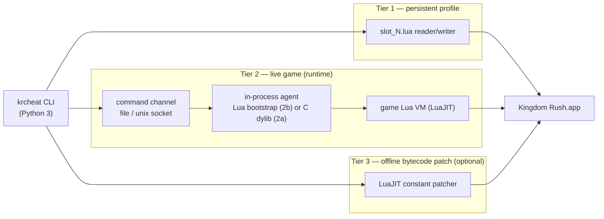

# Kingdom Rush — macOS Trainer: Review & Project Proposal

**Status:** proposal for review — **superseded by [`KRCHEAT_FOUNDATION.md`](KRCHEAT_FOUNDATION.md)**
**Date:** 2026-09-16
**Author:** analysis performed against the locally installed game + this repo

> This is the earlier, shorter proposal. The canonical specification for the `krcheat` project
> — with the full persistence model, runtime contract, CLI contract, safety model and open
> questions — is [`KRCHEAT_FOUNDATION.md`](KRCHEAT_FOUNDATION.md). Where the two disagree, the
> foundation document wins.
>
> **Divergences after the review of 2026-09-16** (foundation §2.1, D1–D8):
>
> * §4.1 here describes the save codec as a parser/emitter pair. It is now specified as
>   **lossless**: untouched bytes are re-emitted verbatim (D1, foundation §12).
> * §6 here specifies "timestamped backup before every write". It is now **one snapshot per
>   command run** (D6, foundation §15.2), and the safety model is file-level only.
> * §4.2 here treats Transport A as the general answer and Transport B as the fallback. If
>   spike S2 passes, **Transport B becomes the simpler one** — a single generated file in the
>   save directory (D3, foundation §9.8).
> * §4.3 here presents the bytecode patcher as an optional stretch goal. It is now **backlog**,
>   expected to be unnecessary (foundation §14).
> * No GUI is proposed here; a **tkinter wrapper** over the shared core was added (F16,
>   foundation §9.5).

---

## 1. How the existing (Windows) trainer works

Stack:

| Piece | Role |
| --- | --- |
| `Form1.cs` / `Form1.Designer.cs` | WinForms GUI: 2 checkboxes (Gold, Health) + a textbox/button (Upgrades) |
| `Memory.dll` (`Mem` class) | Third-party read/write process-memory library |
| `bin/Debug/kingdomrush.ini` | Address/pointer-chain definitions |
| `Kingdom_Rush_V1.0.CT` | Original Cheat Engine table (same chains) |

Flow:

1. `Form1_Load` starts `backgroundWorker1` (infinite loop on a worker thread).
2. `openGame()` calls `MemLib.getProcIDFromName("Kingdom Rush")`, then verifies
   `Process.MainWindowTitle == "Kingdom Rush HD"` before `OpenGameProcess(pid)`.
   This title check is how it distinguishes the right build from other Unity games.
3. The loop, while checked, repeatedly writes:
   - Gold → `99999`
   - Health → `99999`
4. Unchecking restores the vanilla values (`Gold = 265`, `Health = 20`).
5. The Upgrades button performs a **one-shot** write of the number in the textbox
   (default `65`, which the README says is enough to unlock all upgrades).

The address definitions:

```ini
[codes]
Gold     = mono.dll+001F2680,60,74,108
Health   = mono.dll+001F2680,60,74,104
Upgrades = mono.dll+001F2684,60,f14,1088
```

Reading it: `mono.dll` is the **Mono runtime** shipped with Unity ⇒ the Windows game is
a **Unity + Mono** title. `+0x1F2680` is a location in the runtime's data section that
holds a pointer (typically the static-fields block of a class), and `60, 74, 108` is a
pointer chain to dereference. `Gold`/`Health` are `int` (4 bytes) at offsets `0x108`/`0x104`
of the same object; the upgrade/stars counter lives at the sibling base `+0x1F2684`.

**Takeaway:** the whole Windows design is "resolve a `mono.dll`-relative pointer chain,
then blind-write an `int` in a loop".

---

## 2. What the macOS version actually is (measured findings)

Everything below was verified against the installed copy on this Mac
(Steam `steamapps/common/Kingdom Rush`, app id `246420`, bundle version `6.4.46`).

### 2.1 It is not Unity — it is LÖVE (Love2D)

| Evidence | Value |
| --- | --- |
| `Contents/MacOS/love` | executable is literally named `love` |
| `Contents/PkgInfo` | `APPLLoVe` |
| `Contents/Info.plist` | `CFBundleSignature = LoVe`, `CFBundleIdentifier = com.ironhidegames.kingdomrush.mac.steam` |
| `Contents/Frameworks/` | `love.framework` (v0.10.1), `Lua.framework`, `SDL2`, `OpenAL-Soft`, `Vorbis`, `Theora`, `Ogg`, `FreeType`, `libsteam_api.dylib` |
| `conf.lua` constants | `console`, `physics`, `modules`, `conf`, `love` |

⇒ `mono.dll` does not exist on macOS, and **no offset or pointer chain from the Windows
trainer is transferable**. That is the single most important conclusion of this review.

### 2.2 Engine details

| Fact | Value |
| --- | --- |
| Framework | LÖVE **0.10.1** (`love.framework` `CFBundleShortVersionString`) |
| Script VM | **LuaJIT 2.1.1700008891** (Lua 5.1 semantics) |
| Binary | Mach-O universal, `x86_64` + `arm64` (this Mac runs the `x86_64` slice) |
| Host | macOS 15.7.9, `x86_64` |

### 2.3 The game logic is Lua, shipped as bytecode

`Contents/Resources/game.love` is a **ZIP archive**, 358 MB, 1476 entries, of which
**555 are `.lua` modules** (`main.lua`, `conf.lua`, `main_globals.lua`, `all/…`,
`kr1/…`, `all-desktop/…`, `_assets/…`).

The modules are **compiled LuaJIT bytecode** (magic `1B 4C 4A 02`), so the source is not
directly readable — **but LuaJIT keeps string constants in plaintext**, which makes the
data model minable without a decompiler:

```
all/game.lua      -> player_gold, lives, lives_left, stars, restart_count, game-start
all/storage.lua   -> load_file, write_file, SETTINGS_FILE, loadstring, setfenv, sio
all/storage_mappings.lua -> KR_GAME, slot_, slot_common, stars, map_difficulty, last_level
all/debug_tools.lua      -> store.game, game_outcome, lives_left, "time warp (%sx)", "hide-gui"
kr1-desktop/dotnet_slot_parser.lua -> SaveGame, starsWon, stars, campaignWin, heroicModeWin
main_globals.lua  -> KR_PLATFORM="mac", KR_TARGET="desktop", KR_GAME="kr1"   (only 3 constants, 119 bytes)
```

Two things worth highlighting:

* `all/storage.lua` loads persisted data with `loadstring` + `setfenv` ⇒ **save files are
  real Lua chunks returning a table**. They can be generated/edited by anything that can
  print Lua.
* There is a **debug tooling module** in the shipped build (`all/debug_tools.lua`) with
  references to `hide-gui`, `game-victory`, `game_outcome` and a **"time warp (%sx)"**
  speed multiplier. That means in-process speed hacks are likely just a variable set.

### 2.4 Save data is plain-text Lua

The LÖVE identity for this title is `kingdom_rush`, so persistent data lives in
`~/Library/Application Support/kingdom_rush/`:

```
global.lua     first_launch_time, marketing.session_count, news.*
settings.lua   fps, volume_music, volume_fx, locale, texture_size, width/height, vsync, …
slot_1.lua     the profile (see schema below)
steam_autocloud.vdf
```

`slot_1.lua` shape (measured, `kr1-desktop-6.4.46`):

```lua
local obj1 = {
    ["achievements"]        = { ["FIRST_BLOOD"] = true, … },
    ["achievement_counters"]= { ["DIE_HARD"] = 159813, … },
    ["bag"]                 = { },
    ["difficulty"]          = 1,
    ["gems"]                = 4154,
    ["heroes"]              = { ["selected"] = "hero_magnus",
                                ["status"] = { ["hero_malik"] = { ["skills"] = {}, ["xp"] = 0 }, … } },
    ["levels"]              = { [1] = { [1]=1, [2]=1, [3]=1, ["stars"]=3 }, … [23] = { } },
    ["seen"]                = { ["TIP_RALLY"]=true, ["enemy_yeti"]=true, ["tower_tesla"]=true, … },
    ["upgrades"]            = { ["archers"]=4, ["barracks"]=4, ["engineers"]=3,
                                ["mages"]=3, ["rain"]=5, ["reinforcements"]=5 },
    ["version_string"]      = "kr1-desktop-6.4.46",
}
return obj1
```

Notes:

* `upgrades.*` is the **purchased tower/spell upgrade level** — i.e. exactly what the
  Windows trainer's "Upgrades = 65" button achieved. The original wrote the *star balance*;
  on macOS the purchased levels are stored directly, so we can set them outright.
* `levels[n]` holds per-level completion flags (`[1]`,`[2]`,`[3]` — almost certainly
  campaign/heroic/iron, inferred) plus `stars`. Total stars shown in the upgrade screen are
  derived from these, which is why the profile has no top-level `stars` field.
* Save files are **mirrored to Steam Cloud** (`userdata/<id>/246420/remotecache.vdf` lists
  `kingdom_rush/slot_1.lua`). This matters for the safety model (§6).

### 2.5 Injection surface (for the live/runtime part)

The bundle is signed with an unusually permissive entitlement set:

```
com.apple.security.cs.allow-dyld-environment-variables   true
com.apple.security.cs.allow-jit                          true
com.apple.security.cs.allow-unsigned-executable-memory   true
com.apple.security.cs.disable-library-validation         true
```

Consequences:

* `DYLD_INSERT_LIBRARIES` **is honoured** by this binary, and unsigned/third-party dylibs
  **are allowed to load**. So an in-process helper can be loaded at launch **without root,
  without re-signing, without disabling SIP**.
* `Frameworks/Lua.framework` exports the **complete Lua C API** (87 `lua_*` / `luaL_*`
  symbols, including `luaL_loadstring`, `luaL_loadbuffer`, `lua_pcall`, `lua_getfield`,
  `lua_setfield`, `lua_pushnumber`, `lua_tolstring`).

⇒ We can run arbitrary Lua inside the game, i.e. a fully general trainer instead of a
blind `int` writer.
Caveat: `task_for_pid`-style *attaching* to an already-running Steam-launched process is the
awkward case (needs the `get-task-allow`/debugger entitlement or root), which is why the
proposal prefers **launching** the game ourselves.

---

## 3. Requirements mapping

| Original feature | Windows mechanism | macOS equivalent | Difficulty |
| --- | --- | --- | --- |
| **Gold** | blind int write in a loop | set the live `player_gold` each frame (or on demand) | medium (live channel) |
| **Health** (lives) | blind int write in a loop | set live `lives` / `lives_left` | medium (live channel) |
| **Upgrades** | int write of star balance | set `upgrades.*` in `slot_N.lua` = unlock everything | **easy (pure file edit)** |
| *(new)* level stars | — | set `levels[n].stars = 3` / all modes | easy |
| *(new)* gems, hero XP/skills, achievements, `seen` unlocks | — | same file | easy |
| *(new)* game speed / god mode | — | live Lua (the debug module proves the hooks exist) | medium |

So roughly **half of the original trainer's value is achievable with a pure-Python file
editor**, and the rest needs an in-process Lua channel.

---

## 4. Proposed project

**Name:** `krcheat` (CLI), directory `macos/` inside this repo (or a new repo).

**Language:** Python 3 (stdlib only for tiers 1 & 3), plus a ~250-line C dylib for the
optional tier 2a. Deliberately *not* C++ — there is no performance need, and the whole
value is in fast iteration on Lua snippets and file formats.



### 4.1 Tier 1 — `profile` commands (no injection, guaranteed to work)

Pure Python, no dependencies, no root — just parse and rewrite the save file.

```
krcheat profile show                    # pretty-print current profile
krcheat profile set gems 999999
krcheat profile set upgrades all=5      # archers/barracks/engineers/mages/rain/reinforcements
krcheat profile set stars all           # levels[n] = {[1]=1,[2]=1,[3]=1,stars=3}
krcheat profile set level 14 stars 3
krcheat profile unlock heroes
krcheat profile set hero_xp hero_malik 20000
krcheat profile set achievements all
krcheat backup list | restore <id>
```

Implementation notes:

* A small, dependency-free **Lua-table reader** (`lua_table.py`) that parses the
  `local obj1 = { … } return obj1` subset — the files are machine-generated, so the grammar
  is tiny (numbers, strings, booleans, nested tables, intermixed `["k"]=v` and `[n]=v`).
* A **writer** that emits byte-identical style (tab indentation, escaped strings,
  `["key"]` form, `;` terminators) so diffs stay minimal and the game's `loadstring`
  round-trip is trivially satisfied.
* **Always** copy the file to `~/.krcheat/backups/<timestamp>/` before writing, write to a
  temp file and `os.replace()` atomically.
* `version_string` and unknown/forward-compatible keys are preserved verbatim.
* Support `--slot N` (`slot_1.lua` … ; the game has a slot screen, so multiple profiles exist).
* A verification step that re-parses what we wrote before swapping it in.

This tier alone delivers the "Upgrades" feature (plus gems/heroes/achievements) and is the
milestone to ship first because it cannot break anything irreversible.

### 4.2 Tier 2 — live cheats (gold, lives, speed, god mode)

The CLI talks to an **in-process agent** through a command channel. Two interchangeable
transports, one shared protocol, so the CLI is written once:

**Protocol** (deliberately dumb and debuggable): the CLI writes a Lua snippet plus a request
id into a command file (or sends it over a unix socket); the agent executes it on the game's
Lua thread and writes back `{id, ok, values[]}`. All game-specific knowledge lives in Python
as a library of snippets — the agent stays generic ("evaluate this Lua, return results").

```
krcheat play                      # launch game with the agent loaded
krcheat play --no-cheats          # plain launch
krcheat live gold 99999           # one-shot
krcheat live gold infinity        # apply every frame (the "checkbox" behaviour)
krcheat live lives infinity
krcheat live speed 3              # debug "time warp" multiplier
krcheat live off
krcheat probe                     # dump the game's globals so we can discover field paths
```

**Transport A (recommended) — `DYLD_INSERT_LIBRARIES` launcher + C dylib.**
The CLI launches `Contents/MacOS/love` itself with
`DYLD_INSERT_LIBRARIES=kr_agent.dylib` and `SteamAppId=246420`. The dylib:

1. `__attribute__((constructor))` → `dlopen` the Lua framework.
2. `__DATA,__interpose` on `luaL_newstate`/`lua_newstate` to capture the single
   `lua_State *`.
3. `__DATA,__interpose` on `SDL_GL_SwapWindow` (fallbacks: `SDL_PollEvent`,
   `love::graphics::Graphics::present`) to get a **once-per-frame tick that runs on the main
   thread while the VM is idle** — the only safe window to call `lua_pcall`.
4. On each tick: if the command file changed, `luaL_loadbuffer` + `lua_pcall`, then
   serialise the returned values.
   It also keeps a `state.lua`-installed "apply every frame" snippet for `infinity` mode.

Pros: touches **nothing** in the game install; no root; no signature concerns; instant
iteration. Cons: needs `clang` (Xcode CLT) once, and the game must be launched by the CLI
(Steam overlay/cloud sync will not be active in that session — which is actually *safer*
for save editing). Ad-hoc-sign the dylib (`codesign -s -`) so the same binary also works if
the user later switches to an Apple-silicon Mac, where unsigned arm64 dylibs are rejected.

**Transport B — pure Python/Lua, patch `game.love` (no compiler at all).**
`game.love` is a ZIP; extract `main_globals.lua` (119 bytes, 3 globals), replace it with an
equivalent **Lua source** file that defines `KR_PLATFORM/KR_TARGET/KR_GAME` *and* installs a
bootstrap that polls the command channel, then repack the archive (keeping a pristine backup
in `~/.krcheat/`. ~10–30 s for 358 MB, one time). Then the user launches the game normally
from Steam and `krcheat live …` still works.

Pros: zero compilation, zero injection, works with a normal Steam launch, and doubles as a
modding platform (add a Lua console hotkey, etc.).
Cons: modifies game files (Steam "Verify integrity of game files" reverts it — the CLI can
re-apply), and it assumes `main.lua` `require`s `main_globals` by name and that a stable
per-frame Lua hook exists (`love.timer.step` / `love.graphics.present` are good candidates).

**Transport C — attach to a Steam-launched process (fallback).** `pip install frida` and
attach; needs `sudo` on macOS in practice, so it is the last resort.

*Recommendation: build A, keep B as the no-compiler fallback. They share the protocol, so
this costs one extra transport class.*

### 4.3 Tier 3 — offline LuaJIT bytecode patches (optional / experimental)

The LuaJIT bytecode keeps its constant pool readable, and the bytecode itself can be
patched in place if the replacement constant fits. That enables permanent tweaks with no
runtime channel at all — e.g. starting gold, starting lives, per-wave gold rewards
(`kr1/data/waves/levelNN_waves_*.lua` are pure data modules).

```
krcheat patch scan 265            # find candidate constants (the Windows trainer's default gold!)
krcheat patch scan 20 lives
krcheat patch apply --dry-run
```

Scope: number-constant replacement in a copied `game.love`, plus a diff report. Treated as
a stretch goal, not required for feature parity.

---

## 5. Repository layout

```
macos/
  README.md
  pyproject.toml                 # no runtime deps for tiers 1/3
  krcheat/
    cli.py                       # argparse entry point (single `krcheat` command)
    paths.py                     # app bundle / save dir / slot discovery
    lua_table.py                 # dependency-free Lua table reader + writer
    profile.py                   # Tier 1 operations (gems, upgrades, stars, heroes…)
    backup.py                    # timestamped backups, atomic writes, restore
    live/
      protocol.py                # command/response framing (file or socket)
      transport_dylib.py         # launcher + DYLD injection (Transport A)
      transport_patched.py       # install/uninstall the game.love bootstrap (Transport B)
      transport_frida.py         # optional attach fallback (Transport C)
      snippets.py                # the game-specific Lua (gold/lives/speed/probe)
    patch/
      luajit.py                  # bytecode constant scanner/patcher (Tier 3)
    agent/
      kr_agent.c                 # the injected dylib
      Makefile                   # clang -arch x86_64 -arch arm64; codesign -s -
  PROPOSAL.md                    # this document
```

---

## 6. Safety model

| Risk | Mitigation |
| --- | --- |
| Corrupting a profile | timestamped backup before every write; `krcheat backup restore <id>`; atomic `os.replace` |
| Bad Lua emitted by the writer | re-parse + validate the generated file before swapping it in; `--dry-run` diff |
| Steam Cloud overwriting local edits | detect `remotecache.vdf`; warn and recommend playing with Cloud off for this title, or make edits while Steam is closed; launch via the CLI (no cloud sync) |
| Steam reverting a patched `game.love` | keep a pristine copy, `krcheat repair` re-applies; document that "Verify integrity" undoes it |
| Crashing the game with live cheats | all writes are reversible; `krcheat live off`; snippets are validated in a scratch Lua state first where possible |
| Game updates invalidating field paths | `krcheat probe` re-discovers paths at runtime instead of hard-coding addresses (this is why the design is offset-free, unlike the Windows trainer) |
| Apple silicon | ad-hoc-sign the dylib; keep Transport B as a no-compiler path |

---

## 7. Milestones

| # | Deliverable | Effort | Verified by |
| --- | --- | --- | --- |
| M0 | **Assumption spike.** Patch one value (e.g. `gems`) in `slot_1.lua` by hand, launch, confirm it shows in-game | 15 min | in-game currency/stars screen changes |
| M0b | Spike A1: does `require` prefer the save dir? Drop a shadow `main_globals.lua` in the save dir and see if it loads (decides if we can skip repacking) | 15 min | observable side effect from the shadow module |
| M0c | Spike A2: `clang` present? Build a "hello" dylib, inject, confirm it loads (log a line) | 20 min | a line in `Console.app` / a log file |
| **M1** | `krcheat profile show/set/backup/restore` (Tier 1, pure Python) — **feature parity for "Upgrades"** | 1–2 d | modify gems/upgrades/stars, restart game, observe |
| M2** | `krcheat probe` + live channel with `gold`/`lives` (Transport A) | 2–3 d | gold/lives change mid-level |
| M3 | Both transports behind the shared protocol; `krcheat play`; `infinity` per-frame mode | 1–2 d | Steam-launched game still controllable |
| M4 | Extras: `speed`, god mode, `unlock heroes`, full `levels` editor | 1–2 d | manual |
| M5 | Tier 3 bytecode patch scanner (optional) | 2–3 d | `--dry-run` diff + in-game behaviour |

The order is deliberate: M1 delivers user-visible value on day one with zero risk, and M0's
spikes de-risk every uncertain assumption *before* M2 is committed to.

---

## 8. Open questions to settle in the M0 spikes

1. **A1 — `love.filesystem` precedence.** Does the save directory shadow the game directory
   for `require` in LÖVE 0.10.1? If yes, Transport B becomes ~20 lines instead of a ZIP
   repack, and Tier 2 gets even cheaper. (Could not be confirmed offline; the LÖVE wiki is
   not reachable from this environment.)
2. **A2 — exact field path for gold/lives.** `player_gold`, `lives`, `lives_left` exist in
   `all/game.lua`, and `all/systems.lua` / `all-desktop/game_gui.lua` reference them, but the
   *global owner* (e.g. `GAME`, `store.game`) must be confirmed at runtime via `probe`.
   Note the desktop build's `store.game` is loaded from `slot_1.lua`, whereas the live level
   state is a separate object.
3. **A3 — per-frame hook point** that the game never reassigns (candidates:
   `love.timer.step`, `love.graphics.present`, `SDL_GL_SwapWindow`).
4. **A4 — behaviour when launched outside Steam**: does the game still start (achievements,
   news, cloud)? `SteamAppId=246420` should cover the app-id lookup, but this needs a test.
5. **A5 — level-mode semantics** of `levels[n][1..3]` and whether "all stars" should also fill
   heroic/iron modes (currently inferred).

---

## 9. Non-goals

* No multiplayer/multiplayer-adjacent abuse — Kingdom Rush is single-player.
* No bypassing DRM or Steam ownership checks.
* No redistributing game assets or bytecode.
* No GUI (the original WinForms front end is not worth porting; the CLI is enough, as
  requested). A thin `--watch` mode can mimic the original's "checkbox" behaviour.

---

## Appendix A — evidence commands

```sh
APP="$HOME/Library/Application Support/Steam/steamapps/common/Kingdom Rush/Kingdom Rush.app"
plutil -p "$APP/Contents/Info.plist"            # bundle id / version / signature
file "$APP/Contents/MacOS/love"                 # universal x86_64 + arm64
cat "$APP/Contents/PkgInfo"                     # APPLLoVe
strings -a "$APP/Contents/Frameworks/Lua.framework/Versions/A/Lua" | grep 'LuaJIT'
nm -gU "$APP/Contents/Frameworks/Lua.framework/Versions/A/Lua" | grep ' T _lua' | wc -l
codesign -d --entitlements - "$APP/Contents/MacOS/love"
unzip -l "$APP/Contents/Resources/game.love" | tail -1        # 1476 files
unzip -p "$APP/Contents/Resources/game.love" main_globals.lua | xxd | head -2   # 1B 4C 4A 02
strings -n 4 "$APP/Contents/Resources/game.love"              # n/a, must extract first
ls -la "$HOME/Library/Application Support/kingdom_rush"
cat "$HOME/Library/Application Support/Steam/userdata/<uid>/246420/remotecache.vdf"
```

## Appendix B — profile schema (measured)

| Key | Type | Notes |
| --- | --- | --- |
| `version_string` | string | `kr1-desktop-6.4.46` — preserve, likely used for save migration |
| `gems` | int | premium currency (4154 in the current save) |
| `difficulty` | int | 1 in the current save |
| `upgrades` | table\<string,int\> | `archers`, `barracks`, `engineers`, `mages`, `rain`, `reinforcements` |
| `levels` | table\<int,table\> | per level: `[1]`,`[2]`,`[3]` completion flags + `stars` |
| `heroes.selected` | string | e.g. `hero_magnus` |
| `heroes.status.<hero>.xp` / `.skills` | int / table | per-hero progression |
| `achievements` | table\<string,bool\> | unlocked flags |
| `achievement_counters` | table\<string,int\> | progress counters |
| `seen` | table\<string,bool\> | encyclopedia/tip unlock flags |
| `bag` | table | appears unused in this save |
